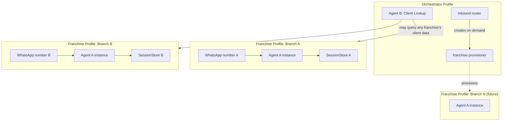
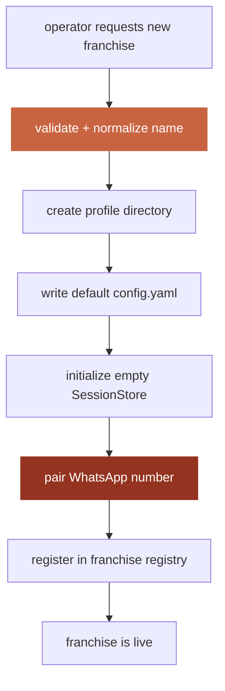
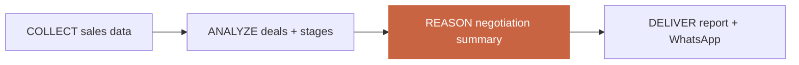

# Ornare Harness — Architecture

**Status:** Day 1 of a 10-day build. This document is the single source of
truth for every interface in the system. Every later day's code must match
what's specified here; if reality and this doc diverge, fix the doc in the
same change that fixes the code.

**What this is:** a production-scale successor to the hand-built Ornare
agent system (5 manually-wired Hermes profiles), built from scratch as our
own harness so it can scale to dozens of franchises without hand-wiring
each one, and so new agents/channels/integrations can be added by writing
one adapter instead of restructuring the system.

---

## 1. The problem, restated precisely

Two new agent capabilities were requested, inferred from handwritten notes
pending a formal written brief:

- **Agent A — Franchise Sales & Negotiation Intelligence.** Per-franchise:
  collect sales data, analyze it, produce dashboards, track negotiation
  actions/stage, generate a per-franchise report (sales performance,
  production → delivery). Delivered over WhatsApp. Access gated by a
  whitelist. Some actions require human approval before the agent acts.
- **Agent B — Client Lookup / Intelligence.** Given a client, research
  them (web + any available internal data), synthesize a "story" — a
  profile the sales/account team can use to serve that client better.
  Not franchise-scoped; any franchise can trigger a lookup.

**Confirmed scoping decision:** each franchise is a fully isolated
identity — its own WhatsApp number, its own data, its own session
history. This is NOT "one number serving N franchises as a data
dimension" (that was my initial lower-effort suggestion; rejected). This
has a direct architectural consequence worked through in §4.

---

## 2. Design principles carried over from the harness curriculum

These are not new — they're the Day 1–7 principles, applied to a real
deadline instead of a lesson plan:

1. **Interfaces are generic; implementations are scoped to real need.**
   Every subsystem below has an abstract contract. We implement only the
   concrete adapters this product needs today. Adding a new one later is
   "write one adapter, register it" — never a rewrite of the interface or
   its callers.
2. **One small core; capability lives at the edges.** The agent loop does
   not grow special cases per agent or per franchise. Agent A and Agent B
   are both just "a system prompt + a toolset + a pipeline," running on
   the exact same loop.
3. **Directory-per-profile isolation (Day 7), used for real this time.**
   Each franchise IS a profile. Full filesystem isolation: own config,
   own credentials, own session store, own WhatsApp pairing.
4. **Prompt caching discipline (Day 5)** applies to every agent's system
   prompt: stable tier first, volatile tier last, never rebuilt
   mid-conversation.
5. **Pipelines are deterministic except one stage (Day 4/Ornare
   precedent).** COLLECT and ANALYZE are plain code, no model calls.
   REASON is the one LLM call, with a locked prompt and a strict output
   schema. DELIVER is plain code. This is the exact shape that worked for
   Pulse/Scout/Sentry and it transfers directly to Agent A.
6. **Blast radius (Day 2), applied to provisioning.** The provisioning
   flow (§4) that creates a new franchise profile is itself a
   high-blast-radius operation — it touches the filesystem, generates
   credentials, and pairs a real phone number. It gets the most scrutiny
   of any tool in this system.

---

## 3. System-wide architecture

<!-- DIAGRAM 1: system-overview.mmd -->



**Reading this diagram:** the orchestrator never runs Agent A itself — it
owns provisioning and routes. Each franchise profile is a complete,
isolated instance of Agent A's blueprint. Agent B lives once, at the
orchestrator level, because a client lookup isn't owned by one franchise.

---

## 4. The provisioning flow (new — this is the harness's real scalability test)

With N potentially-dozens of franchises, nobody is hand-creating `profiles/branch-17/`
the way Ornare's 5 agents were hand-built. Provisioning must be a real,
callable operation.

<!-- DIAGRAM 2: provisioning-flow.mmd -->



**Design decisions for this flow:**

- **Validation (orange box) is the same hardened `normalize_profile_name`/
  `validate_profile_name` pattern from Day 7** — a franchise name becomes
  a directory name and a config key; it is untrusted input the moment an
  operator types it.
- **WhatsApp pairing (red box) is the highest blast-radius step** — it's
  the one step that touches a real external resource (a phone number)
  and can't be cleanly rolled back by just deleting a directory. It is
  therefore the LAST step, after everything reversible has already
  succeeded, and it is never silently retried — a failed pairing leaves
  the franchise profile in a clearly-marked `pending_pairing` state
  rather than partially live.
- **A franchise registry** (a small table, not a full database) is the
  one piece of shared, orchestrator-level state: which franchise profiles
  exist, their status, which WhatsApp number maps to which franchise.
  This is intentionally thin — it does NOT hold any franchise's sales
  data, only "where do I find franchise X's isolated store."

---

## 5. Subsystem interfaces

Each interface below follows the same contract-first discipline from the
curriculum (Day 3's "ask what the loop needs before writing the first
implementation"). Only interfaces are specified here; implementations
land day by day per the plan in §8.

### 5.1 `ModelProvider` (from Day 3, carried over unchanged)
```python
class ModelProvider(Protocol):
    def chat(self, messages, system, tools) -> ModelResponse: ...
    def stream(self, messages, system, tools) -> Iterator[StreamEvent]: ...
```
Concrete adapter today: `AnthropicProvider`. No second provider needed yet
— do not build one speculatively (Day 1 YAGNI principle).

### 5.2 `Tool` + `ToolRegistry` (from Day 4, carried over unchanged)
Per-agent registries: Agent A's registry and Agent B's registry are
different instances with different registered tools. A franchise profile
never sees Agent B's tools and vice versa — this is enforced by which
registry gets wired into that profile's loop, not by a runtime check.

### 5.3 `SystemPrompt` (from Day 5, carried over unchanged)
Three-tier (stable/context/volatile). New wrinkle for this product: the
STABLE tier differs per agent type (Agent A's identity/rules vs. Agent
B's) but is byte-identical across every franchise running Agent A — the
franchise-specific data (branch name, numbers) belongs in the volatile
tier or in tool results, never baked into the stable prompt, or every
franchise would need its own cache-cold prompt for no real reason.

### 5.4 `SessionStore` (from Day 6, carried over unchanged)
One instance per profile (per Day 7). A franchise's SessionStore lives at
`profiles/<franchise>/sessions.db`. Agent B, running at the orchestrator
level, has its own `profiles/orchestrator/sessions.db`.

### 5.5 `ProfileManager` (from Day 7, EXTENDED)
Day 7's version only created/validated/listed profiles. This product
needs the `FranchiseRegistry` on top (see §4) — a thin layer that adds
franchise-specific metadata (WhatsApp number, status, branch display
name) without touching `ProfileManager`'s own generic contract.

### 5.6 `Channel` (NEW — not yet built in the curriculum, needed by Day 5)
```python
class Channel(Protocol):
    def receive(self) -> NormalizedMessage: ...
    def send(self, chat_id: str, content: str) -> None: ...
    def send_bulk(self, chat_ids: list[str], content: str) -> BulkResult: ...
    def format(self, markdown: str) -> str: ...
```
Concrete adapter: `WhatsAppChannel`, reusing the already-debugged Baileys
bridge + markdown-to-WhatsApp formatter proven on the real Ornare system.
`send_bulk` is new — needed for the "WhatsApp → bulk" requirement — built
as a thin loop over `send` with rate-limiting, not a separate code path.

### 5.7 `Pipeline` (NEW — formalizes the proven Ornare COLLECT/ANALYZE/REASON/DELIVER shape)
```python
class PipelineStage(Protocol):
    def run(self, context: PipelineContext) -> PipelineContext: ...
```
A `Pipeline` is an ordered list of stages. COLLECT/ANALYZE/DELIVER stages
are plain Python. Exactly one REASON stage per pipeline makes the model
call, with a locked prompt file and a strict JSON output schema — this
mirrors Pulse/Scout/Sentry's `reason_prompt.md` pattern exactly.

### 5.8 `WhitelistGate` (NEW — access control for Agent A's bulk/negotiation actions)
A simple allow-list check at the tool-execution boundary (Day 2's
blast-radius principle: validate at the point of execution, not just in
the prompt) — any tool that sends WhatsApp messages or performs a
negotiation action checks the calling number/chat against the current
franchise's whitelist before executing, not after.

### 5.9 `ApprovalGate` (NEW — human-in-the-loop for Agent A, same pattern as Rapid)
Reuses the proven Rapid pattern: a drafted action is posted with a
numbered-reply approval prompt (1=Accept/2=Reject/3=Edit) before it's
actually executed. This is a tool-level wrapper, not a loop-level
special case — any tool can be marked `requires_approval=True` at
registration time.

---

## 6. Agent A — Franchise Sales & Negotiation Intelligence (per-franchise instance)

**Pipeline shape (Day 4/Ornare pattern):**

<!-- DIAGRAM 3: agent-a-pipeline.mmd -->



- **COLLECT**: franchise's own sales records (source TBD pending the
  formal brief — likely a spreadsheet/CRM export per franchise, same
  shape as Pulse's showroom CSVs today).
- **ANALYZE**: deal stage, stalled-deal detection, negotiation-action
  flags — deterministic code, directly reusing Pulse's analyze.py
  pattern.
- **REASON**: one locked-prompt LLM call producing the negotiation
  summary + recommended actions, strict JSON schema, "never invent a
  number" rule (same hard rule as every Ornare REASON prompt).
- **DELIVER**: per-franchise report formatted and sent to that
  franchise's own WhatsApp number; any action requiring approval goes
  through `ApprovalGate` first.

## 7. Agent B — Client Lookup (single, orchestrator-level instance)

<!-- DIAGRAM 4: agent-b-pipeline.mmd -->


This is Scout's exact shape (real web_search + a locked REASON prompt
that must hedge when evidence is thin — same "match_confidence: none by
default" discipline Sentry already proved out) pointed at people/
companies instead of competitors. No new architecture needed here beyond
wiring it to accept a request from ANY franchise profile, not just the
orchestrator's own chat.

---

## 8. Day-by-day build plan (locked in from the planning conversation)

| Day | Deliverable |
|---|---|
| 1 | This document + repo scaffold + diagrams (today) |
| 2 | Core agent loop + `ModelProvider` + `ToolRegistry`, hardened for production (real error handling, no shortcuts) |
| 3 | `SystemPrompt` builder + `SessionStore` + `ProfileManager`, wired together |
| 4 | Config/secrets loader + `Pipeline` runner (the COLLECT/ANALYZE/REASON/DELIVER engine) |
| 5 | `WhatsAppChannel` adapter + `WhitelistGate` + `ApprovalGate` + the provisioning flow (§4) |
| 6–7 | Agent A: full pipeline, tools, prompts, tested against at least 2 provisioned franchise profiles |
| 8 | Agent B: full pipeline, tools, prompts |
| 9 | Integration: orchestrator routes real inbound messages to the right franchise/agent, end-to-end WhatsApp test across 2+ franchises |
| 10 | Hardening pass, verification, docs, handoff |

---

## 9. Open questions (pending Ornare's formal written report)

These are explicitly flagged rather than guessed into the architecture:

- What system is the actual source of sales data per franchise (manual
  export? live CRM API? spreadsheet?) — affects COLLECT's real
  implementation in Day 6–7, not the architecture itself.
- Exact definition of "stale" / "negotiation action" thresholds.
- What exactly "Comp Client Lookup → Story" should contain — how deep,
  what format, who reads it.
- Meaning of "28–29" next to the per-franchise report line in the notes.
- Whether franchises need to message EACH OTHER's data (e.g. a head
  office rollup across all franchises) — if yes, this needs a new
  cross-franchise reporting role, deliberately NOT built speculatively
  today per the YAGNI principle, added only if the report confirms it's
  needed.

None of these block Days 1–5 (pure harness infrastructure). They start
to matter at Day 6.
