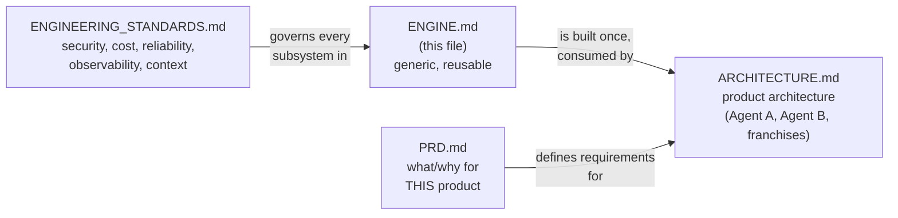
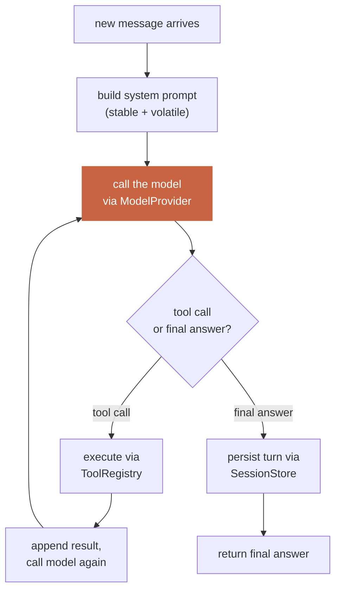

# The Engine — Harness Architecture

**This document describes the engine. It does not mention franchises,
Agent A, Agent B, WhatsApp-for-sales, or any other business-specific
concept.** If you find a business-specific word in this file, that's a
bug in this document — move it to `docs/ARCHITECTURE.md` (the product
architecture, which consumes this engine) instead.

**Relationship to the other docs:**



`docs/ENGINEERING_STANDARDS.md` is this engine's non-negotiable
cross-cutting rulebook — security, cost management, reliability,
observability, permissions, and context management. Read it alongside
this file; every subsystem below must satisfy it.

The engine is the thing we are actually building as "our harness." Any
future agent Ornare asks for — a third, a tenth — is a new consumer of
this same engine, not a new engine. If building a new agent ever requires
changing this file, that is a signal the engine's interface was wrong,
not that the engine needs a one-off special case.

---

## 0. What "the engine" means, precisely

The engine is everything an agent needs to exist, run, remember, be
reached, and be extended — independent of what that agent's job is. It
is the accumulated subsystems from the harness-engineering curriculum
(Days 1–25), hardened to production quality, assembled into one coherent
system. Concretely, the engine is the answer to: *if someone handed you a
blank folder and said "build me a new agent with a new job," what already
exists so you only have to write the NEW part?*

The engine owns:
- Running a conversation (the agent loop)
- Talking to a model (provider abstraction)
- Giving an agent capabilities (tool registry)
- Giving an agent identity and rules (system prompt builder)
- Remembering (session store)
- Being more than one agent identity safely (profiles)
- Config and secrets
- Running on a schedule or in response to an event (pipeline runner)
- Being reachable from the outside world (channel abstraction)
- Being extended without being rewritten (plugins/skills/tools as
  edge capability, not core growth)

The engine does NOT own: what any specific agent's job is, what data it
collects, what it says, or which channel instance (which WhatsApp number,
which franchise) it's wired to at runtime. All of that is product-layer,
specified in `docs/ARCHITECTURE.md` and built in Days 6 onward.

---

## 1. The core loop

<!-- the one thing every agent in the system runs on, unconditionally -->



**Hard invariants the loop must never violate** (carried over verbatim
from the curriculum, because violating any of these is a real, not
theoretical, class of production bug):

1. **Strict role alternation.** No two same-role messages back to back;
   every `tool_use` gets exactly one matching `tool_result`, in order.
2. **The system prompt is never rebuilt mid-conversation.** Built once
   (stable tier) at conversation start; only the volatile tier changes,
   appended fresh per turn, never touching the stable tier's bytes.
3. **No tool call ever raises an uncaught exception into the loop.** Tool
   execution always returns a structured result, success or
   `is_error: true`, never an unhandled stack trace.
4. **One agent identity does not see another's state during a run** —
   enforced by which `SystemPrompt`, `ToolRegistry`, and `SessionStore`
   instances the loop is constructed with, not by a runtime permission
   check inside the loop itself.

The loop itself is intentionally dumb: it does not know what a
"franchise" or a "client lookup" is. It only knows: call the model, check
the response shape, execute a tool if asked, persist, repeat.

---

## 2. Subsystem: Model access (`ModelProvider`)

**Problem it solves:** different model vendors speak different wire
protocols; the loop must not care which one it's talking to.

**Interface:**
```python
class ModelProvider(Protocol):
    def chat(self, messages, system, tools) -> ModelResponse: ...
    def stream(self, messages, system, tools) -> Iterator[StreamEvent]: ...
```

**Engineering judgment baked into this subsystem:**
- The interface was designed by asking "what does the loop need," never
  by extracting an interface from one vendor's working code — avoids the
  interface quietly being shaped like one vendor's API.
- Provider-specific quirks are absorbed INSIDE the one adapter that has
  the quirk, never leaked into the shared interface and never requiring
  a call-site workaround. A new quirk discovered in production is a
  one-file fix.
- Retry/backoff lives inside the adapter: the loop's vocabulary is
  exactly "got a response" or "this genuinely failed" — never "failed
  once, retried, succeeded."
- Context-window size and similar REAL per-model differences are
  deliberately NOT hidden — exposed in real units, because callers that
  need to reason about them (e.g. the pipeline runner deciding how much
  history to load) need the true number, not a lowest-common-denominator
  fiction.

**Concrete adapters implemented:** `AnthropicProvider`. A second provider
is added only when a real, named need exists — not speculatively.

---

## 3. Subsystem: Capability (`Tool` + `ToolRegistry`)

**Problem it solves:** an agent needs to DO things (not just talk), and
the set of things it can do must be addable without touching the loop.

**Interface:**
```python
class Tool:
    name: str
    description: str          # the ONLY thing the model reasons from
    parameters: JSONSchema
    handler: Callable
    check_fn: Callable | None # optional runtime enable/disable
    requires_approval: bool = False

class ToolRegistry:
    def register(self, tool: Tool) -> None: ...
    def get_schemas(self, context=None) -> list[dict]: ...
    def dispatch(self, name: str, args: dict, context=None) -> ToolResult: ...
```

**Engineering judgment baked into this subsystem:**
- **Design surface vs. execution surface.** The model only ever sees
  `name` + `description` + `parameters`. A wrong description is a bug
  that never throws an exception — it just causes silent misuse.
- **Tool independence.** No tool's behavior may depend on another tool
  having already run or on shared mutable state — the agent only
  reasons about the schema-level contract and has no visibility into
  hidden coupling.
- **Blast radius.** Every tool is evaluated for how much damage it can do
  if misused, prompt-injected, or called with malformed arguments.
  Validation happens at the tool's execution boundary, never trusted
  from the model's arguments alone, regardless of what the schema
  "should" guarantee.
- **check_fn vs. not registering at all.** `check_fn` is for a
  RUNTIME-reevaluated availability decision (e.g. a credential isn't
  configured yet); simply not registering a tool is for a
  STARTUP-time decision. Conflating the two is a common mistake this
  engine avoids deliberately.
- **Footprint cost.** Every registered tool's schema is sent on every
  single model call for that conversation — tool registration is a
  recurring token-cost budget, not a free action. Tools are grouped into
  named, independently-enabled bundles rather than all being active in
  every context.
- **Declarative self-registration**, not a centrally-maintained list —
  adding a tool means writing one file that registers itself, not
  touching a second central location (a common silent-failure mode:
  forgetting the second edit leaves a tool that exists but is never
  callable).

**Concrete tool implementations:** added per-agent, at the product layer
(Days 6–8), using this registry — the registry itself has zero
business-specific tools built in.

---

## 4. Subsystem: Identity (`SystemPrompt`)

**Problem it solves:** every agent needs a persona + rules + live context,
assembled in a way that doesn't destroy prompt caching.

**Interface:**
```python
@dataclass(frozen=True)
class SystemPrompt:
    stable: str                    # identity + rules, built once
    volatile_fn: Callable[[], str] # re-evaluated fresh every turn

    def render(self) -> str: ...
    def static_prefix(self) -> str: ...
```

**Engineering judgment baked into this subsystem:**
- **Ordering is load-bearing, not cosmetic.** Stable content first,
  volatile last — because caching works on a byte-exact PREFIX match;
  anything after the first point of difference is never cached. Putting
  volatile content first silently defeats caching for the entire prompt,
  every single turn.
- **Never rebuild mid-conversation.** The one narrow, deliberate
  exception (not a casual one) is context compression — a controlled,
  cost-justified cache-reset, not an everyday operation.
- **Identity and behavioral rules are kept as separable sections within
  the stable tier**, even though both are "stable" — so one agent's
  branding/persona can be swapped later without touching its behavior
  rules, and vice versa.
- **Resist over-tiering.** Start with exactly two tiers (stable/volatile).
  Add more granularity only with concrete evidence a specific volatile
  piece is churning the cache too often to justify staying coarse — more
  tiers is more surface area for a subtle cache-boundary bug.

**Concrete usage:** every agent built on this engine supplies its OWN
`stable` content (its identity, its rules) — the engine provides the
mechanism, never the content.

---

## 5. Subsystem: Memory (`SessionStore`)

**Problem it solves:** a conversation must survive a process restart, be
resumable, and preserve exact role-alternation fidelity through a
write-then-read round trip.

**Interface:**
```python
class SessionStore:
    def create_session(self, session_id: str, **meta) -> None: ...
    def append_message(self, session_id: str, role: str, content) -> None: ...
    def load_messages(self, session_id: str, max_messages: int) -> list[Message]: ...
    # raises TranscriptTooLargeError rather than silently truncating
```

**Engineering judgment baked into this subsystem:**
- **Append-only.** Messages are added, never mutated or deleted in
  place — mutation breaks post-incident debuggability, interacts badly
  with prompt caching, and defeats any future audit/undo capability.
  Repair of a malformed sequence belongs in the READ path (detect and
  handle), not as in-place rewriting of stored history.
- **SQLite + WAL mode**, deliberately, at this scale: one writer, many
  concurrent readers, zero operational overhead, one file per
  store. The explicit condition that would change this answer:
  independent machines needing to write the SAME store over a network —
  WAL solves concurrent LOCAL access, not distributed access. This
  engine does not reach for a network database until that condition is
  real.
- **Unbounded-cost operations get an explicit ceiling.** Loading or
  exporting a session's full history is bounded by a real,
  deliberately-chosen maximum, with a named error on overflow — never
  left to whatever memory/runtime happens to tolerate before failing
  uncontrolled.
- **Session identity is scoped to "one logical conversation,"** neither
  too broad (one ID forever — unbounded growth, slow loads) nor too
  narrow (new ID per message — destroys caching and conversational
  continuity). When a conversation legitimately needs to split (e.g.
  after compression), it does so via an explicit lineage reference, not
  a silently different identity.

---

## 6. Subsystem: Identity isolation (`ProfileManager`)

**Problem it solves:** the engine must support more than one agent
identity existing on the same machine WITHOUT their state, credentials,
or memory bleeding into each other.

**Interface:**
```python
class ProfileManager:
    def __init__(self, root: Path): ...          # anchored once, never to "whichever profile is active"
    def create_profile(self, name: str) -> Profile: ...
    def get_profile(self, name: str) -> Profile: ...
    def list_profiles(self) -> list[Profile]: ...

@dataclass(frozen=True)
class Profile:
    name: str
    dir: Path
    config_path: Path
    session_db_path: Path
```

**Engineering judgment baked into this subsystem:**
- **Full filesystem isolation is the default**, not a shared store
  filtered by a profile-id column. The failure mode of a forgotten
  `WHERE profile_id = ?` is silent, undetectable data leakage that
  passes every single-profile test. The failure mode of directory
  isolation done wrong is a visibly wrong PATH — a much harder mistake
  to make silently. This engine accepts the operational cost of more
  files in exchange for that safety property.
- **A manager that enumerates "all profiles" must be anchored above any
  single profile, never inside one.** A manager accidentally anchored to
  "the current profile's home" cannot see its own siblings — a real,
  easy-to-introduce scoping bug this engine actively guards against in
  its own constructor contract (root is passed in explicitly, once).
- **Profile names are untrusted input the moment they're accepted** —
  normalized (case-folding, etc.) and validated (reject empty, reject
  path-traversal characters, reject anything that would break being used
  as both a directory name and a CLI/config argument) before they ever
  touch the filesystem.
- **One profile is correct when there is no real second identity to
  isolate from.** This engine does not default every deployment to
  multi-profile "just in case" — profiles exist because a genuine
  boundary (a second identity, a second client, a second isolated use
  case) is real, not because the capability exists.

---

## 7. Subsystem: Config & secrets

**Problem it solves:** every profile needs its own behavioral settings
and its own credentials, without secrets ending up in version control or
behavioral settings ending up scattered across ad hoc environment
variables.

**Contract:**
- `config.yaml` per profile — all BEHAVIORAL settings (timeouts,
  feature flags, which tools/channels are enabled, thresholds). Never
  secrets.
- `.env` per profile — ONLY credentials (API keys, tokens, passwords).
  Never behavioral settings.
- A config loader resolves `config.yaml` + `.env` into one runtime config
  object per profile, at process start, for that profile only — it does
  not reach across into another profile's files.

**Engineering judgment:** this split exists because the two have
different handling requirements (config is safe to read/review/commit;
secrets are not) and different failure modes (a leaked behavioral
setting is a non-event; a leaked secret is an incident). Conflating them
into one file makes both harder to handle correctly.

---

## 8. Subsystem: Scheduling & deterministic work (`Pipeline` + runner)

**Problem it solves:** most of an agent's real work is NOT a free-form
conversation — it's a scheduled or event-triggered job that should do as
little non-deterministic (model-dependent) work as possible, for cost,
reliability, and auditability.

**Interface:**
```python
class PipelineStage(Protocol):
    def run(self, context: PipelineContext) -> PipelineContext: ...

class Pipeline:
    stages: list[PipelineStage]
    def run(self) -> PipelineContext: ...
```

**Engineering judgment baked into this subsystem:**
- **The proven shape is COLLECT → ANALYZE → REASON → DELIVER**, with
  COLLECT/ANALYZE/DELIVER as plain deterministic code and exactly ONE
  model call in REASON. This is deliberate: minimizing the number of
  non-deterministic steps makes a pipeline's behavior auditable, its
  cost predictable, and its failures debuggable (you can always tell
  whether a bad output came from bad data or bad reasoning).
  Multi-model-call pipelines are avoided unless a real, specific need
  justifies the added non-determinism.
  - 
  - This shape is reused, not reinvented, for every new job the engine
    runs — any product-layer agent follows the same stage ordering.
- **A failed REASON stage must never produce a partial DELIVER.** The
  runner does not let a half-completed pipeline leak output.
- **REASON's output is schema-constrained and hard-ruled against
  fabrication** — every pipeline's REASON prompt enforces "never invent
  a number not present in ANALYZE output," and where applicable, "default
  to no-match/no-confidence unless there is real evidence" — this is an
  engine-level convention every REASON prompt follows, not something each
  agent reinvents.
- The runner is a thin scheduler (cron-equivalent + a trigger for
  event-driven runs) — it does not grow business logic of its own.

---

## 9. Subsystem: Reachability (`Channel`)

**Problem it solves:** an agent needs to receive and send messages
through some external surface (messaging platform, email, webhook) —
the loop and pipeline runner must not be coupled to which one.

**Interface:**
```python
class Channel(Protocol):
    def receive(self) -> NormalizedMessage: ...
    def send(self, chat_id: str, content: str) -> SendResult: ...
    def send_bulk(self, chat_ids: list[str], content: str) -> BulkResult: ...
    def format(self, markdown: str) -> str: ...
```

**Engineering judgment baked into this subsystem:**
- `format()` exists as its own method, not inlined into `send()`,
  because markdown-to-platform-native conversion is a real, previously
  debugged, non-trivial piece of logic (real bold vs. literal asterisks,
  heading structure, platform-specific limits) that deserves to be
  independently testable and reused across `send`/`send_bulk`.
- `send_bulk` is NOT a separate code path reimplementing delivery — it's
  `send` applied per-recipient with explicit per-recipient success/
  failure reporting, so a caller can always tell exactly who did and
  didn't receive a message (never a silent partial failure).
- A new channel (a second platform) is one new class implementing this
  interface — the loop, pipeline runner, and every existing agent remain
  completely unaware a new channel was added.

**Concrete adapters:** reused from the original Ornare build — the
already-debugged WhatsApp bridge + formatter — wrapped behind this
interface rather than called directly, so it's swappable later without
touching any caller.

---

## 10. Subsystem: Access control & human oversight (`WhitelistGate`, `ApprovalGate`)

**Problem it solves:** some tool executions are consequential enough
that they must be restricted to authorized recipients and/or require
human sign-off before they run — this must be enforced centrally, not
reimplemented per tool.

**Interfaces:**
```python
class WhitelistGate:
    def is_allowed(self, scope: str, recipient_id: str) -> bool: ...

class ApprovalGate:
    def request(self, scope: str, summary: str, payload: dict) -> ApprovalRequestId: ...
    def resolve(self, request_id, decision: Literal["accept","reject","edit"], edit=None) -> None: ...
```

**Engineering judgment:**
- Checked at the TOOL EXECUTION boundary — inside the handler, never
  only as prompt guidance the model is trusted to honor. This is the
  blast-radius principle applied concretely: untrusted-origin actions
  (the model deciding to call a tool) are re-validated at the point
  where real-world effect happens.
- `ApprovalGate` is a generic mechanism any tool can opt into via a
  `requires_approval=True` flag at registration — not a special case
  wired into one agent's code. A tool so flagged never executes
  directly; it always routes through `request()`, and only a matching
  `resolve(..., "accept")` lets it run.

---

## 11. Extensibility surfaces (skills, plugins, MCP)

**Problem they solve:** new capability must be addable at the EDGES of
the engine, without growing the core loop or its always-sent tool
schemas.

- **Skills** — markdown procedural knowledge, loaded into context on
  demand (by keyword/explicit reference), not compiled into code. Used
  for "how to do X" guidance an agent should follow without that
  guidance costing a permanent slot in the core tool schema.
- **Plugins** — Python modules that register new tools/adapters at
  startup through the SAME `ToolRegistry`/`Channel` interfaces already
  defined above. A plugin never reaches into the loop's internals.
- **MCP (Model Context Protocol)** — treated as a "buy," not a "build":
  for integrations with an existing MCP server, use the official client
  rather than hand-writing the integration. Only hand-write an
  integration as a plain `Tool` when no MCP server exists for it.

**The footprint ladder** (the engine's own stated extension-cost
ordering, poorest-footprint-first): extend existing code → add a skill →
add a `check_fn`-gated tool → add a plugin → use an existing MCP server →
add a brand-new CORE tool, only as an absolute last resort, because a
core tool's schema is paid for on every single model call forever.

---

## 12. What the engine explicitly does not decide

To keep this document honest about its own boundary: the engine does not
decide — and `docs/ARCHITECTURE.md` (product layer) is where these get
decided —

- How many agent identities (profiles) exist, or what each one is for.
- What any specific `Tool` actually does.
- What a `Pipeline`'s COLLECT stage actually collects, or what its
  REASON prompt actually says.
- Which concrete `Channel` instance(s) are wired up, and to what
  real-world account/number.
- Any business vocabulary at all (franchises, clients, sales, or any
  other domain concept).

If a future need ever seems to require changing THIS document to satisfy
one specific agent's requirement, treat that as a signal to re-examine
whether the requirement is really engine-level (affects every consumer)
or product-level (affects only that one agent) before making the change.
