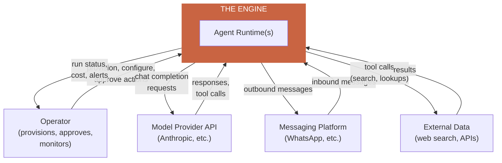
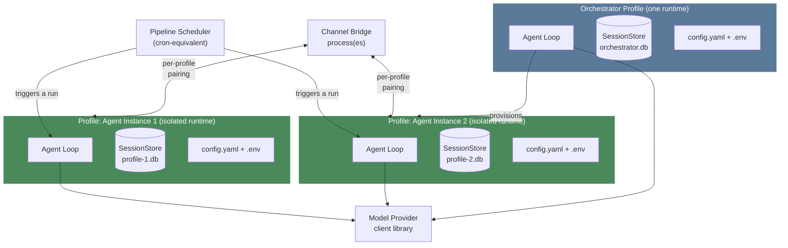
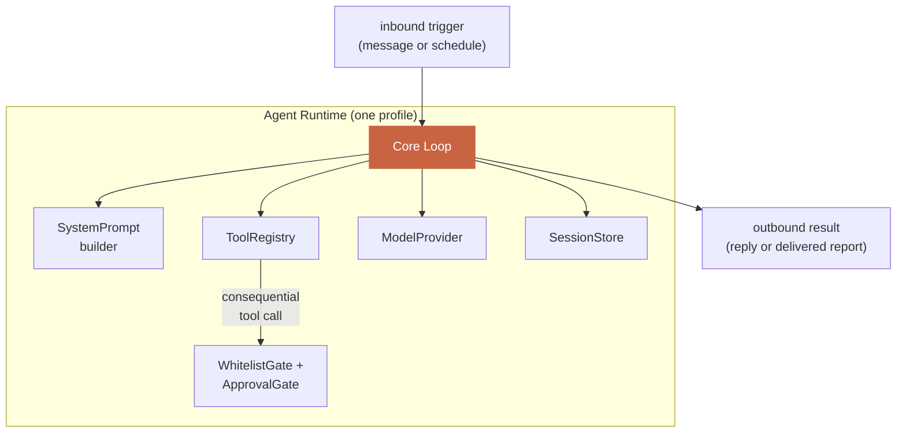
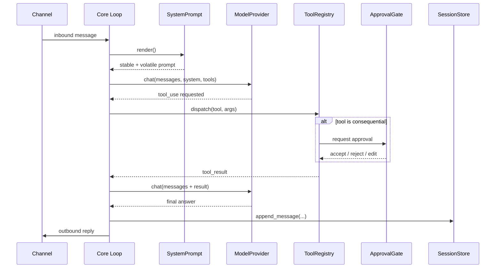

# The Engine — 00. Overview (Read This First)

This is the entry point into the full engine documentation set. It shows
the complete system at four levels of zoom — the same discipline real
systems-architecture documentation uses (System Context → Container →
Component → Sequence) so that "the big picture" and "exactly how one
message flows through the system" are both answerable from this doc set,
not just implied by reading code later.

**Every file in `docs/engine/` is business-agnostic** — no franchises, no
Agent A/B, no WhatsApp-for-sales. That content lives in
`docs/ARCHITECTURE.md`, which consumes everything specified here.

## Reading order for the full engine doc set

```
docs/engine/
  00-OVERVIEW.md          <- you are here: all 4 zoom levels
  01-AGENT-LOOP.md        <- the core loop every agent runs on
  02-MODEL-PROVIDER.md    <- talking to a model vendor
  03-TOOLS.md             <- giving an agent capabilities
  04-SYSTEM-PROMPT.md     <- identity, rules, caching
  05-SESSION-STORE.md     <- memory / persistence
  06-PROFILES.md          <- isolated agent identities
  07-CONFIG-SECRETS.md    <- behavioral settings vs. credentials
  08-PIPELINE-SCHEDULER.md<- scheduled/event-driven deterministic work
  09-CHANNELS.md          <- reachability from the outside world
  10-ACCESS-CONTROL.md    <- whitelist + human approval gates
  11-EXTENSIBILITY.md     <- skills, plugins, MCP — adding capability
                             without growing the core

docs/standards/
  SECURITY.md
  COST.md
  RELIABILITY.md
  OBSERVABILITY.md
  CONTEXT_MANAGEMENT.md
  PERMISSIONS.md
```

**Why this many files, instead of one:** the explicit goal is that when
a new agent is requested later, NOTHING in this directory changes — only
`docs/ARCHITECTURE.md` (and a new agent-specific doc) gets written. That
only works if every subsystem's contract is specified completely and
separately enough that "build agent #3" never requires re-reading or
re-deciding how the engine itself works. One file per subsystem makes
each one a stable, independently-citable contract.

---

## Level 1 — System Context

*Who/what the engine talks to, and why. No internal structure shown yet
— just the engine as one box and everything around it.*



**Reading this:** the engine is a mediator between a human operator, one
or more model vendors, one or more messaging platforms, and whatever
external data a specific agent's tools need. Nothing here says HOW many
agents, what they do, or what platform — that's resolved at the next
level down.

---

## Level 2 — Container View

*What actually runs as separate, independently-deployable/isolatable
units. This is where profile isolation (one of the engine's central
decisions) becomes visible as a real structural boundary, not just a
design principle.*



**Reading this:** every profile (orchestrator or agent instance) is a
self-contained unit with its own loop, its own store, its own config —
this diagram is the direct visual proof of `06-PROFILES.md`'s isolation
claim. The scheduler and channel bridge are shared infrastructure that
reach INTO a profile but never let one profile reach into another's.

---

## Level 3 — Component View (inside one agent runtime)

*Zooming into ONE box from Level 2 — e.g. one profile's Agent Loop — to
show the actual subsystems from `ENGINE.md`/`01`–`11` and how they wire
together at runtime.*



**Reading this:** this is the same shape for EVERY agent runtime in the
system, regardless of what that agent's job is — a franchise's Agent A
instance and the orchestrator's Agent B instance are both exactly this
diagram, with different tools registered into `REG` and different
content in `PROMPT`. This sameness is the point: one engine, many
consumers, zero structural change between them.

---

## Level 4 — Sequence View (one real request, start to finish)

*The most concrete level: tracing one inbound message all the way
through every subsystem, in order, so "how does this actually work" has
one definitive answer.*



**Reading this:** every box in this diagram is a real interface specified
in `01`–`10` of this directory. If a real production bug ever needs
debugging, this sequence is the map for "which file's contract might be
violated here."

---

## What's deliberately NOT shown at any level above

- Which specific messaging platform (WhatsApp vs. anything else) — that's
  a `Channel` implementation detail, see `09-CHANNELS.md`.
- How many profiles exist, or what any of them do — product-layer,
  `docs/ARCHITECTURE.md`.
- Security/cost/reliability/observability/context mechanics — each gets
  its OWN dedicated file in `docs/standards/`, cross-referenced from the
  relevant subsystem file, rather than folded into these diagrams (which
  would make every diagram above unreadable).

## The test for "does this change require touching the engine"

Before any future change (a new agent, a new tool, a new channel): if the
change can be expressed as "register a new X into an existing engine
interface" (a new `Tool`, a new `Channel` adapter, a new `Profile`), it
is product-layer work and **none of the files in this directory should
change**. If it requires a NEW interface or a change to an EXISTING
interface's contract, that's a real engine change — and should be rare,
deliberate, and made here, with every consumer re-checked against the
new contract.
