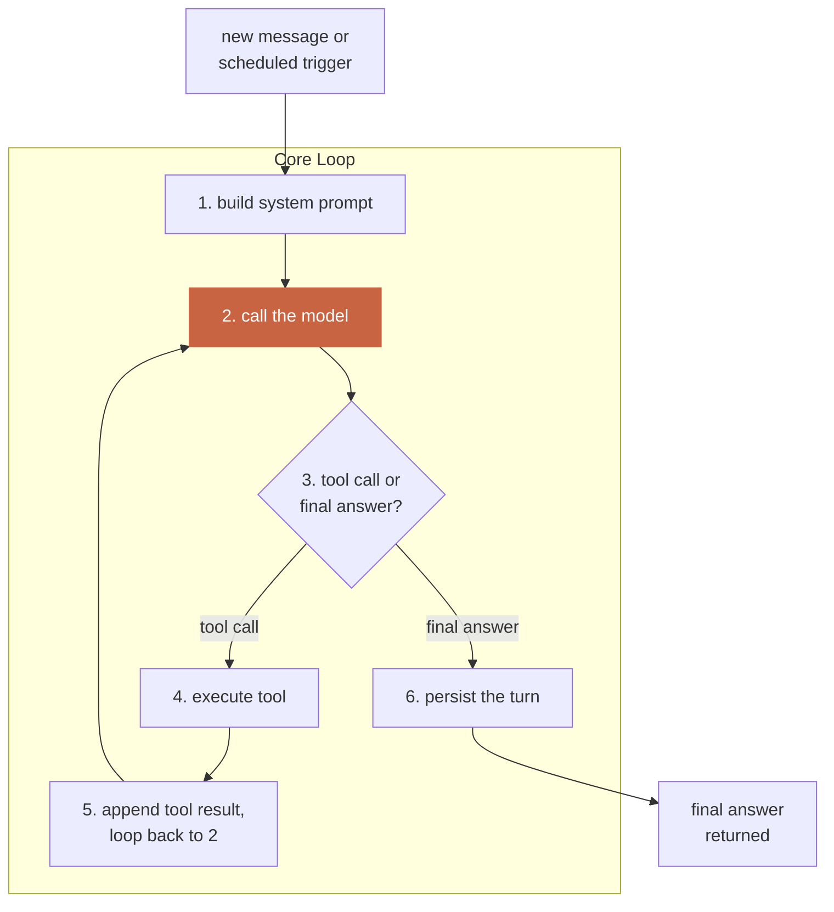
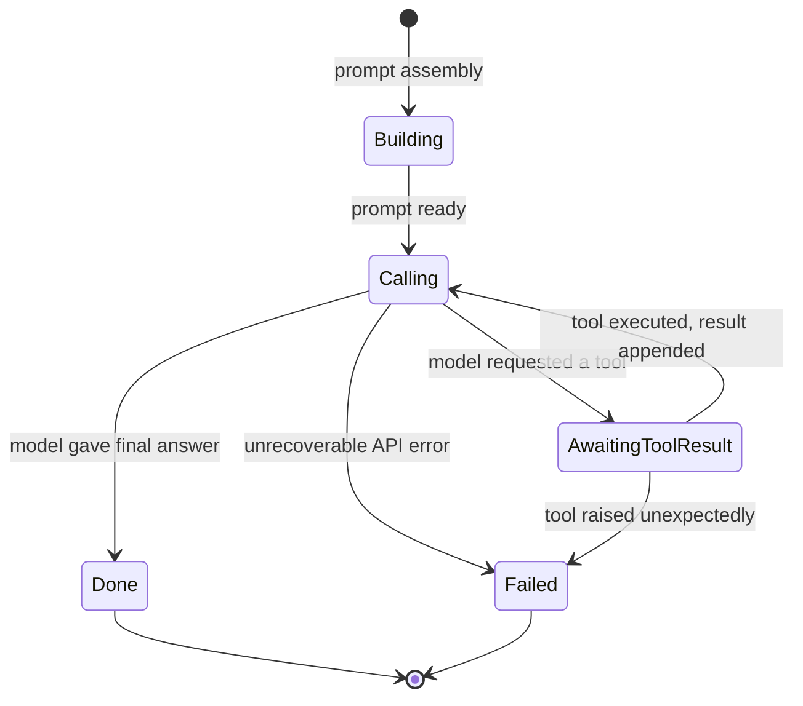

# 01 — The Agent Loop

The one mechanism every agent in the system runs on, unconditionally.
This file owns the loop's contract and its invariants; it does not own
what model is called (`02`), what tools exist (`03`), what the prompt
says (`04`), or how history is stored (`05`) — those are each other
files' contracts, consumed here.

## Component diagram



## State diagram — one turn's lifecycle

*A turn is not just "call the model once." It has real states, and a
production loop must handle every one of them explicitly, not just the
happy path.*



**Hard rule tied to this diagram:** `AwaitingToolResult → Failed` must
never happen from an UNCAUGHT exception — `03-TOOLS.md`'s contract
requires every tool handler to catch its own failures and return a
structured error result, which routes back through `Calling` as a normal
(if unsuccessful) tool result, not a loop crash. A loop reaching `Failed`
should only happen for a genuinely unrecoverable condition (model API
down after retries exhausted — see `docs/standards/RELIABILITY.md`).

## The four hard invariants

1. **Strict role alternation.** No two same-role messages back to back;
   every `tool_use` has exactly one matching `tool_result`, in order.
   Violating this is not a style issue — most provider APIs reject a
   malformed sequence outright.
2. **The system prompt is never rebuilt mid-conversation.** Built once
   (stable tier) at conversation start (`04-SYSTEM-PROMPT.md`); only the
   volatile tier changes, appended fresh per turn, never touching the
   stable tier's bytes. Violating this silently destroys prompt caching
   for the rest of the conversation (see `docs/standards/COST.md`).
3. **No tool call ever raises an uncaught exception into the loop.** See
   the state diagram above — this is a contract `03-TOOLS.md` owns, and
   the loop depends on it absolutely.
4. **One agent identity does not see another's state during a run** —
   enforced by which `SystemPrompt`, `ToolRegistry`, and `SessionStore`
   instances the loop is CONSTRUCTED with (see `06-PROFILES.md`), never
   by a runtime permission check inside the loop itself. The loop has no
   code path that could even attempt to read a different profile's data
   — it simply never holds a reference to it.

## What the loop deliberately does not know

The loop has zero business logic. It does not know what a "tool" does,
what the system prompt says, or what happens after it returns a final
answer. Every one of those is injected from outside (constructor
arguments), which is what makes the SAME loop code correct for every
agent built on this engine — see `00-OVERVIEW.md` Level 3.

## Interface

```python
class AgentLoop:
    def __init__(
        self,
        provider: ModelProvider,        # 02-MODEL-PROVIDER.md
        tools: ToolRegistry,            # 03-TOOLS.md
        system_prompt: SystemPrompt,    # 04-SYSTEM-PROMPT.md
        store: SessionStore,            # 05-SESSION-STORE.md
        session_id: str,
    ): ...

    def run_turn(self, user_message: str) -> str:
        """Runs one full turn (including any tool-call sub-loop) and
        returns the final text answer. Persists every message as it
        goes — a crash mid-turn leaves a recoverable partial history,
        not silent data loss."""
```

## Cross-references

- Security implications of what the loop is constructed with:
  `docs/standards/SECURITY.md` §1 (minimal tool surface) and §4
  (credential/data isolation).
- Reliability contract for step 2 (calling the model):
  `docs/standards/RELIABILITY.md` §1 (classified failure handling).
- Observability: every turn produces a structured record per
  `docs/standards/OBSERVABILITY.md` §1.
