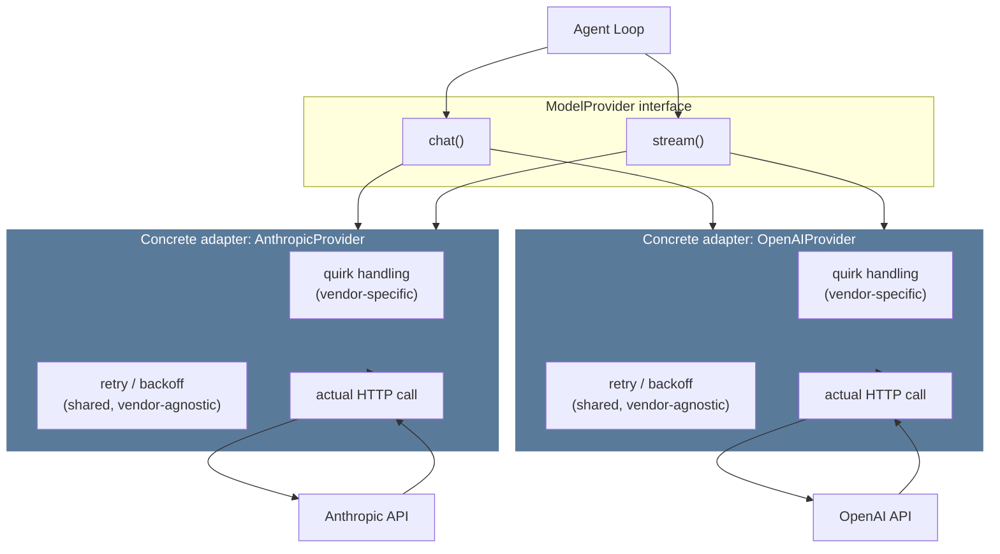
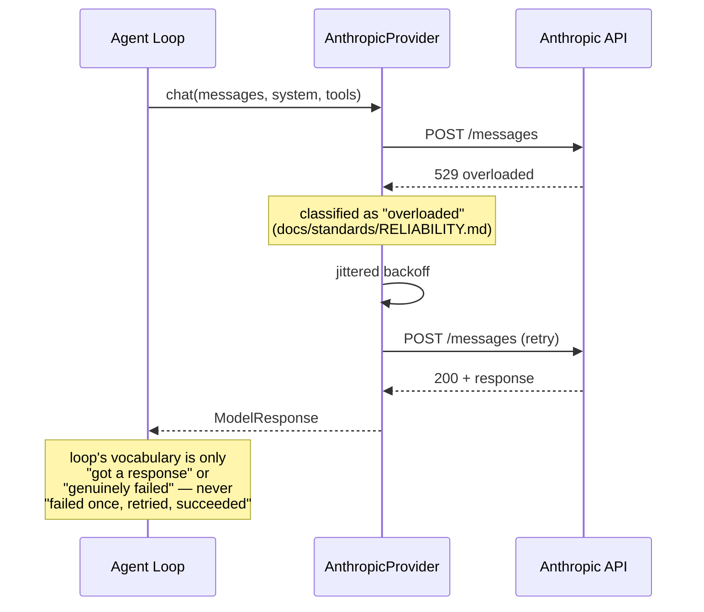

# 02 — Model Provider

**Problem this subsystem solves:** different model vendors speak
different wire protocols (request shape, streaming format, tool-call
encoding, error codes). The loop (`01-AGENT-LOOP.md`) must never know or
care which vendor it's talking to.

## Component diagram



**Reading this:** the loop only ever calls `chat()`/`stream()`. Every
vendor-specific concern (quirks, wire format) is sealed INSIDE each
adapter box — retry/backoff (`agent/retry.py`) is the one piece that's
genuinely shared, not duplicated per adapter, proven by `OpenAIProvider`
reusing the exact same `call_with_retry` + `classify_error` that
`AnthropicProvider` uses, unchanged. A third provider is a new adapter
box implementing the same two methods, zero changes to the loop or to
any existing adapter.

## Sequence diagram — a streamed call with a transient failure

*Shows WHERE retry logic lives and why it must live there, not in the
loop.*



## Interface

```python
class ModelProvider(Protocol):
    def chat(self, messages: list[Message], system: str, tools: list[dict]) -> ModelResponse: ...
    def stream(self, messages: list[Message], system: str, tools: list[dict]) -> Iterator[StreamEvent]: ...
```

## Engineering judgment

- **The interface was designed by asking "what does the loop need,"
  never by extracting an interface from one vendor's already-working
  code.** Extracting backward from one implementation quietly shapes the
  interface like that vendor's API (e.g. its specific error codes, its
  specific streaming event names) — asking "what does the CALLER
  actually need to know" first avoids that trap.
- **Context-window size and similar real per-model differences are
  deliberately NOT hidden behind a lowest-common-denominator
  abstraction.** Exposed in real units, because callers that genuinely
  need to reason about them (e.g. the pipeline runner deciding how much
  ANALYZE output it can safely pass to REASON) need the true number, not
  a fiction averaged across vendors.
- **Retry/backoff lives inside the adapter, never in the loop.** See the
  sequence diagram above.

## Concrete adapters

- `AnthropicProvider` — lives in its own package,
  `agent/adapters/anthropic/` (`provider.py` for the actual adapter
  class, `quirks.py` for model-specific facts like real max-output
  limits), separate from the generic interface in
  `agent/model_provider.py`. This is inspired by Hermes's own real
  pattern of one file per provider adapter (`anthropic_adapter.py`,
  `bedrock_adapter.py`, `vertex_adapter.py`, etc.) — Hermes keeps these
  flat directly in `agent/`, as ONE file each, with no dedicated
  subfolder and no split between request logic and model-specific
  knowledge; we group ours under `agent/adapters/anthropic/` AND split
  that one file into two, a deliberate variation anticipating more
  adapters (and more per-provider knowledge) being added over time.
- `OpenAIProvider` — the SECOND adapter, proving the guarantee above
  for real rather than just asserting it. Lives in
  `agent/adapters/openai/`, the exact same `provider.py` + `quirks.py`
  shape as the Anthropic package. Building it required **zero changes**
  to `model_provider.py`, the loop, or `AnthropicProvider` — confirming
  the design held. Two genuinely different real quirks surfaced and are
  handled entirely inside this package, never leaking outward: (1)
  OpenAI's Chat Completions API has no top-level `system` parameter —
  the system prompt is prepended as the first message instead; (2) the
  `gpt-5.6` family rejects the legacy `max_tokens` parameter outright
  (a live-call-caught 400), requiring `max_completion_tokens` instead —
  found and fixed the same way every other adapter bug in this project
  was: by actually running a real call, not assuming correctness.
- **No third provider is built speculatively.** Per the engine's own
  YAGNI discipline (`docs/engine/00-OVERVIEW.md`'s "test for touching the
  engine"), a third provider is added only when a real, named need
  exists — at that point, it is purely additive: one new adapter
  PACKAGE under `agent/adapters/`, zero changes to this interface, the
  loop, or either existing adapter.

## Cross-references

- Full failure classification table (which error gets which recovery
  strategy): `docs/standards/RELIABILITY.md` §1.
- Cost implications of provider choice and caching:
  `docs/standards/COST.md` §1, §4.
