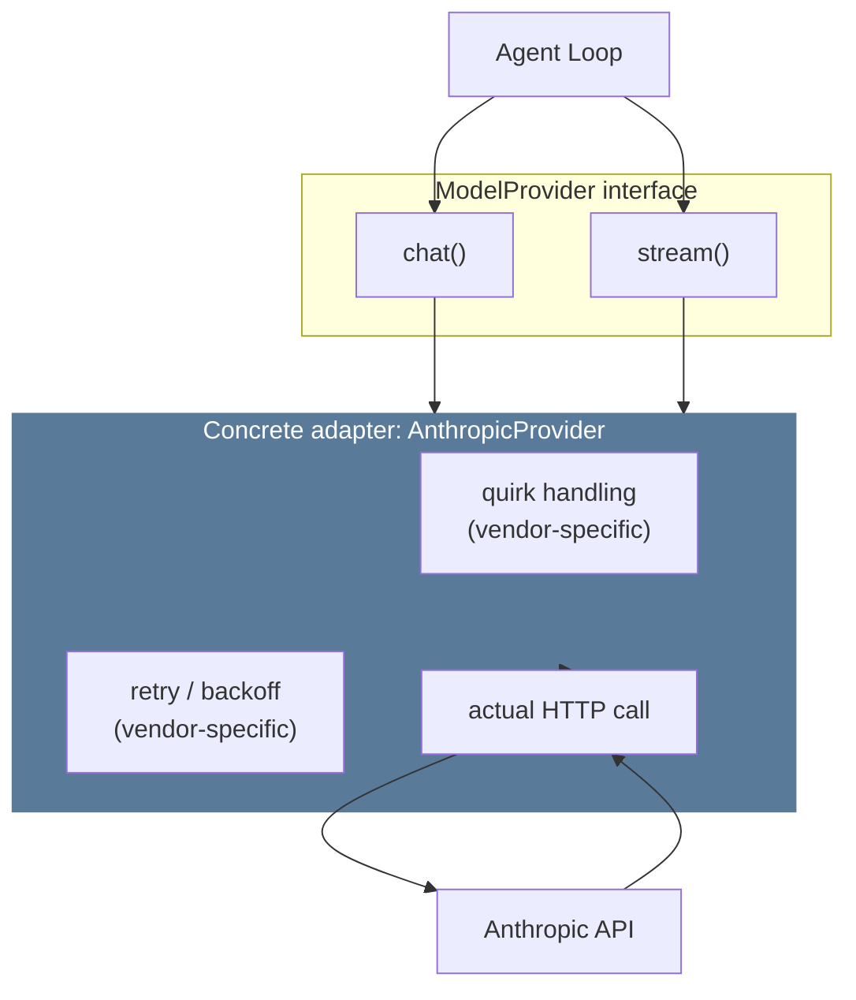
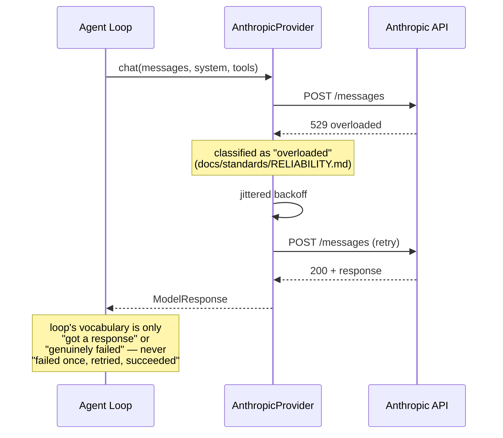

# 02 — Model Provider

**Problem this subsystem solves:** different model vendors speak
different wire protocols (request shape, streaming format, tool-call
encoding, error codes). The loop (`01-AGENT-LOOP.md`) must never know or
care which vendor it's talking to.

## Component diagram



**Reading this:** the loop only ever calls `chat()`/`stream()`. Every
vendor-specific concern (quirks, retries, wire format) is sealed INSIDE
the adapter box — a second provider later (if a real need ever appears)
is a new adapter box implementing the same two methods, zero changes to
the loop or to any existing adapter.

## Sequence diagram — a streamed call with a transient failure

*Shows WHERE retry logic lives and why it must live there, not in the
loop.*



## Interface

```python
class ModelProvider(Protocol):
    def chat(self, messages: list[Message], system: str, tools: list[dict]) -> ModelResponse: ...
    def stream(self, messages: list[Message], system: str, tools: list[dict]) -> Iterator[StreamEvent]: ...
```

## Engineering judgment

- **The interface was designed by asking "what does the loop need,"
  never by extracting an interface from one vendor's already-working
  code.** Extracting backward from one implementation quietly shapes the
  interface like that vendor's API (e.g. its specific error codes, its
  specific streaming event names) — asking "what does the CALLER
  actually need to know" first avoids that trap.
- **Context-window size and similar real per-model differences are
  deliberately NOT hidden behind a lowest-common-denominator
  abstraction.** Exposed in real units, because callers that genuinely
  need to reason about them (e.g. the pipeline runner deciding how much
  ANALYZE output it can safely pass to REASON) need the true number, not
  a fiction averaged across vendors.
- **Retry/backoff lives inside the adapter, never in the loop.** See the
  sequence diagram above.

## Concrete adapters

- `AnthropicProvider` — the only one implemented today. Lives in its own
  file, `agent/anthropic_adapter.py`, separate from the generic interface
  in `agent/model_provider.py` — this matches Hermes's own real pattern
  of one file per provider adapter (`anthropic_adapter.py`,
  `bedrock_adapter.py`, `vertex_adapter.py`, etc., never folded into a
  shared module).
- **No second provider is built speculatively.** Per the engine's own
  YAGNI discipline (`docs/engine/00-OVERVIEW.md`'s "test for touching the
  engine"), a second provider is added only when a real, named need
  exists — at that point, it is purely additive: one new adapter FILE
  (e.g. `agent/openai_adapter.py`), zero changes to this interface, the
  loop, or `AnthropicProvider`.

## Cross-references

- Full failure classification table (which error gets which recovery
  strategy): `docs/standards/RELIABILITY.md` §1.
- Cost implications of provider choice and caching:
  `docs/standards/COST.md` §1, §4.
