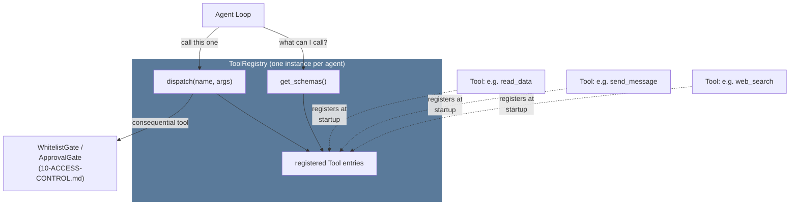

# 03 — Tools & the Tool Registry

**Problem this subsystem solves:** an agent needs to DO things, not just
talk — and the set of things it can do must be addable without touching
the loop, while staying within a strict security and cost discipline
(every registered tool's schema is sent on every model call, forever).

## Component diagram



**Reading this:** tools register themselves INTO a registry instance at
startup (dotted arrows) — the registry never has a hardcoded list of
tools baked into its own code. Two agents get two separate registry
instances with different registered tools; this diagram is identical
for both, only the dotted-line tools differ.

## Sequence diagram — a consequential tool call

```mermaid
sequenceDiagram
    participant LOOP as Agent Loop
    participant REG as ToolRegistry
    participant TOOL as Tool handler
    participant GATE as ApprovalGate

    LOOP->>REG: dispatch("send_bulk", args)
    REG->>REG: look up ToolEntry
    alt tool.requires_approval
        REG->>GATE: request(summary, payload)
        GATE-->>REG: pending... (human has not replied yet)
        Note over GATE: run pauses here;<br/>resumes on resolve()
        GATE-->>REG: accept
    end
    REG->>TOOL: handler(args)
    TOOL-->>REG: ToolResult (success or is_error, never raises)
    REG-->>LOOP: ToolResult
```

## Interface

```python
@dataclass
class Tool:
    name: str
    description: str              # the ONLY thing the model reasons from
    parameters: JSONSchema
    handler: Callable[[dict, Context], ToolResult]
    check_fn: Callable[[], bool] | None = None   # runtime enable/disable
    requires_approval: bool = False
    blast_radius: Literal["read_only", "reversible_write",
                           "consequential_single", "consequential_bulk"]

class ToolRegistry:
    def register(self, tool: Tool) -> None: ...
    def get_schemas(self, context=None) -> list[dict]: ...
    def dispatch(self, name: str, args: dict, context=None) -> ToolResult: ...
```

`blast_radius` is a REQUIRED field, not optional — every tool is
explicitly tiered at registration time (see
`docs/standards/SECURITY.md` §2's full tier table), never left to be
inferred later by someone reading the code.

## Engineering judgment

- **Design surface vs. execution surface.** The model only ever sees
  `name` + `description` + `parameters`. A wrong description is a bug
  that never throws an exception — it silently causes misuse. Schema
  review is a real, recurring engineering task, not a one-time step.
- **Tool independence.** No tool's behavior may depend on another tool
  having already run, or on shared mutable state between tools. The
  model only reasons about each tool's own schema-level contract and has
  no visibility into hidden coupling — coupling it can't see is coupling
  it will eventually violate.
- **Blast radius drives gating, not vibes.** See
  `docs/standards/SECURITY.md` §2 for the full tier table and which
  tiers get mandatory, non-configurable `ApprovalGate`/`WhitelistGate`
  checks.
- **`check_fn` vs. not registering at all.** `check_fn` is for a
  RUNTIME-reevaluated decision (a credential isn't configured yet, a
  feature flag is off); simply never calling `register()` is for a
  STARTUP-time decision (this agent's job never needs this tool).
  Conflating the two is a real, easy mistake — a tool gated only by
  `check_fn` that should never have existed for this agent at all still
  costs schema tokens on every call even while disabled, unless it was
  never registered in the first place.
- **Footprint cost is a real, recurring budget.** Every registered
  tool's schema is sent on every single model call in that conversation.
  Tools are grouped into named bundles enabled per-agent rather than all
  tools being globally available — see `docs/standards/SECURITY.md` §1
  ("no default toolset") and `docs/standards/COST.md`.
- **Declarative self-registration, not a centrally-maintained list.**
  Adding a tool means writing one file that registers itself at import
  time — never touching a second, separate central registration list.
  The common silent-failure mode this avoids: forgetting the second edit
  leaves a tool that exists in code but is never actually callable, with
  no error anywhere.

## Cross-references

- Full blast-radius tier table and mandatory gating rules:
  `docs/standards/SECURITY.md` §2.
- `WhitelistGate`/`ApprovalGate` contracts: `10-ACCESS-CONTROL.md`.
- Token/footprint cost discipline: `docs/standards/COST.md` §2.1.
- Extending capability without growing this registry's footprint
  (skills, plugins, MCP): `11-EXTENSIBILITY.md`.
