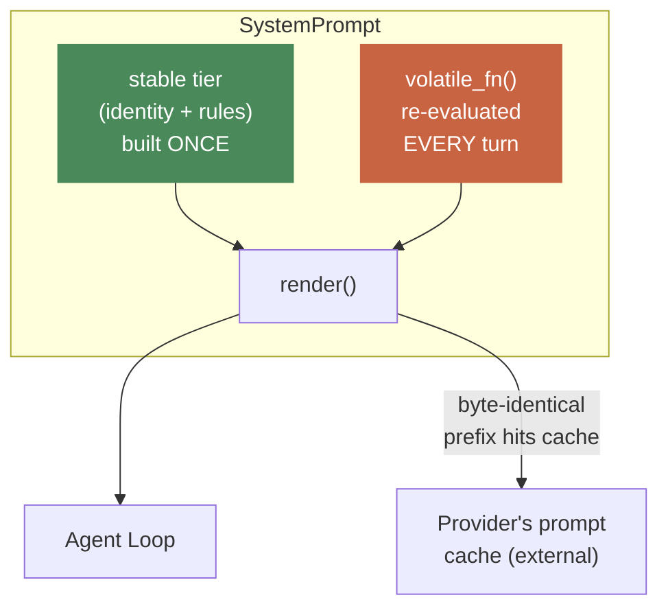
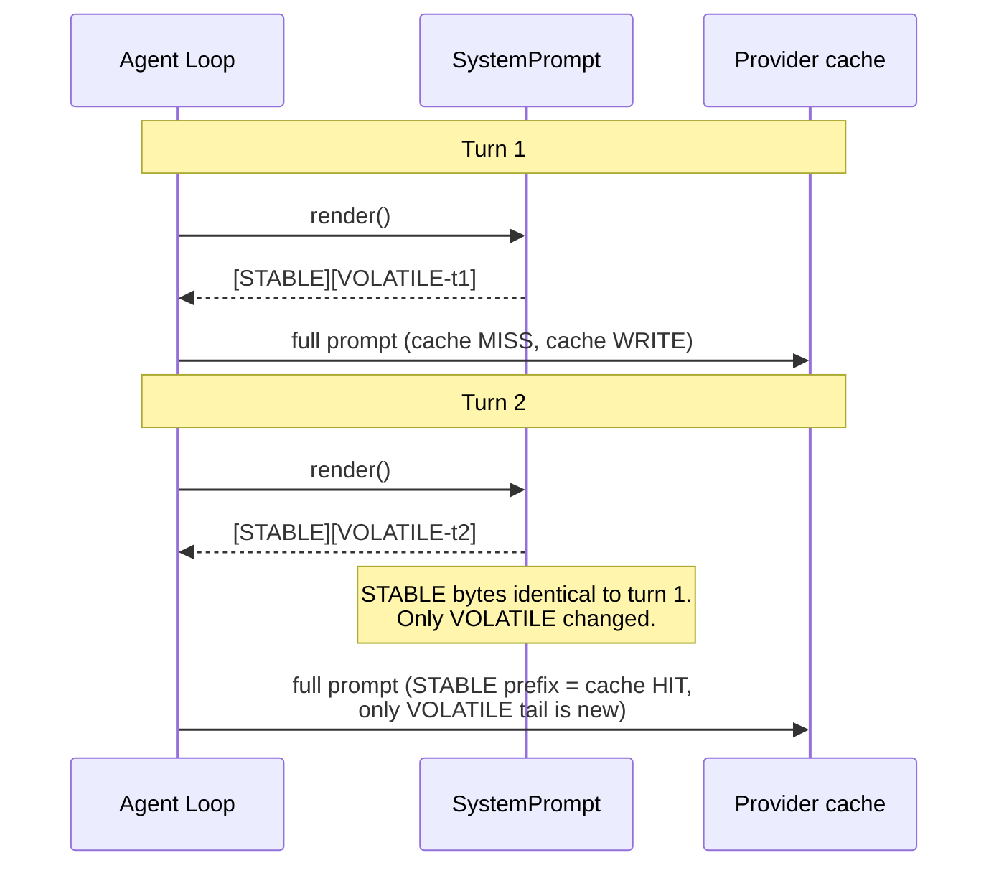

# 04 — System Prompt

**Problem this subsystem solves:** every agent needs a persona + rules +
live context, assembled in a way that doesn't destroy prompt caching
(which is a real, load-bearing cost/latency mechanism, not a nice-to-have
— see `docs/standards/COST.md`).

## Component diagram



**Reading this:** `STABLE` is colored differently from `VOLATILE` on
purpose — this is the single most important visual fact about this
subsystem. Everything in the green box must be byte-identical turn over
turn, for the life of the conversation, or the cache boundary breaks.

## Sequence diagram — ordering is the whole mechanism



## Interface

```python
@dataclass(frozen=True)
class SystemPrompt:
    stable: str
    volatile_fn: Callable[[], str]

    def render(self) -> str:
        return self.stable + self.volatile_fn()

    def static_prefix(self) -> str:
        return self.stable
```

## Engineering judgment

- **Ordering is load-bearing, not cosmetic.** Caching works on a
  byte-exact PREFIX match — anything after the first point of difference
  is never cached. Putting volatile content FIRST silently defeats
  caching for the ENTIRE prompt, every single turn — not a partial
  penalty, a total one. Stable must come first, full stop.
- **Never rebuilt mid-conversation.** The one deliberate, narrow
  exception is context compression (see `docs/standards/CONTEXT_MANAGEMENT.md`)
  — a controlled, cost-justified cache reset, never a casual "let me just
  update one line" mutation.
- **Identity and behavioral rules are kept as separable sections within
  the stable tier**, even though both are "stable" — so an agent's
  branding/persona can be swapped later without touching its behavior
  rules, and vice versa (relevant the moment a second business wants the
  same AGENT TYPE with different branding).
- **Resist over-tiering.** Start with exactly two tiers. Add more
  granularity only with concrete evidence a specific volatile piece is
  churning the cache too often to justify staying coarse — more tiers is
  more surface area for a subtle cache-boundary bug.

## Cross-references

- Full caching economics and the multi-franchise shared-stable-tier cost
  benefit: `docs/standards/COST.md` §4.
- Why this is NOT where conversation history compression happens:
  `docs/standards/CONTEXT_MANAGEMENT.md`.
