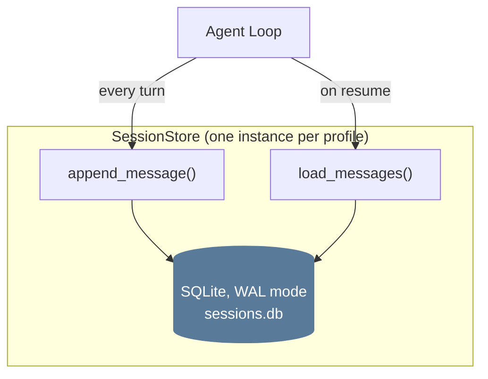
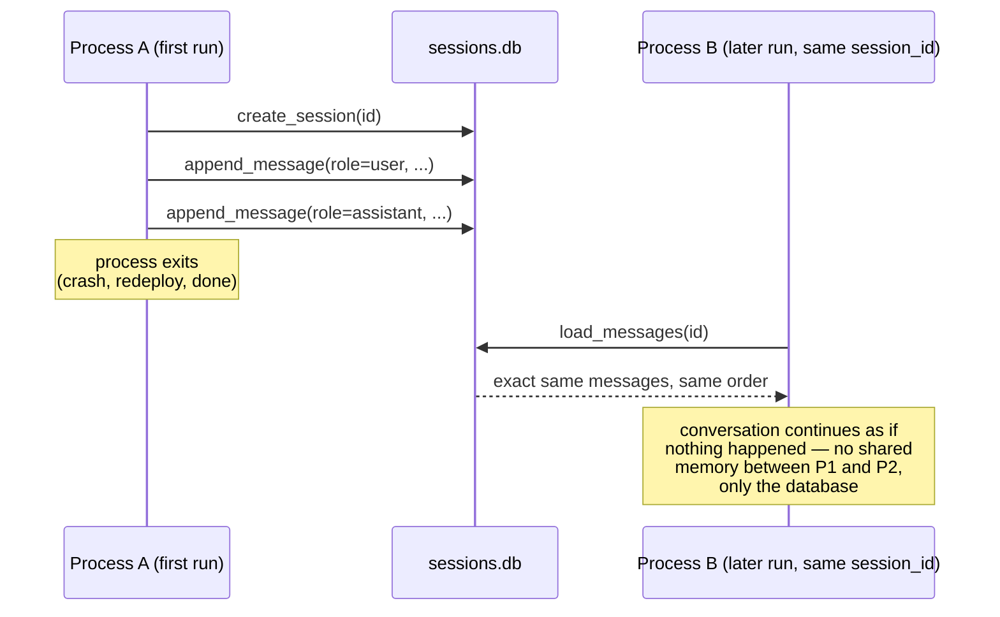
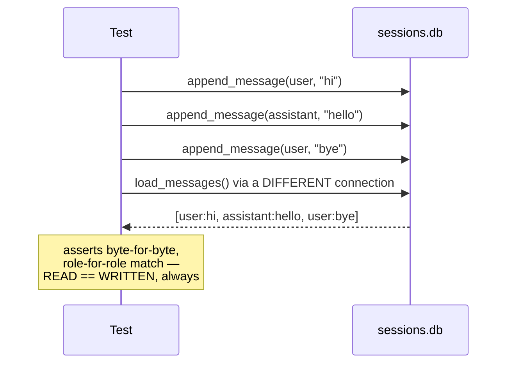

# 05 — Session Store (Memory)

**Problem this subsystem solves:** a conversation must survive a process
restart, be resumable, and preserve exact role-alternation fidelity
through a write-then-read round trip — "memory" that is actually durable,
not an in-process list that dies with the Python process.

## Component diagram



## Sequence diagram — surviving a process restart



## Sequence diagram — the fidelity contract under test



## Interface

```python
class SessionStore:
    def create_session(self, session_id: str, **meta) -> None: ...
    def append_message(self, session_id: str, role: str, content) -> None: ...
    def load_messages(self, session_id: str, max_messages: int) -> list[Message]: ...
    # raises TranscriptTooLargeError rather than silently truncating
```

## Engineering judgment

- **Append-only, no mutation methods.** Messages are added, never
  mutated or deleted in place. Mutation breaks post-incident
  debuggability (you can't reconstruct what a conversation looked like
  at the time of a specific API call if history keeps changing
  retroactively), interacts badly with prompt caching (a cache is keyed
  on exact past content), and defeats any future audit/undo capability.
  Repair of a malformed sequence belongs in the READ path (detect and
  handle), never as in-place rewriting of stored history.
- **SQLite + WAL mode, deliberately, at this scale.** One writer, many
  concurrent readers, zero operational overhead, one file. The specific
  condition that would change this answer: independent MACHINES needing
  to write the SAME store over a NETWORK — WAL solves concurrent LOCAL
  access, not distributed access. This engine does not reach for a
  network database until that condition is real (see
  `docs/standards/COST.md` and the engine's own YAGNI discipline).
- **Unbounded-cost operations get an explicit ceiling.** Loading or
  exporting a session's full history is bounded by a real, deliberately
  chosen maximum, with a NAMED error on overflow — never left to
  whatever memory/runtime happens to tolerate before failing
  uncontrolled.
- **Session identity is scoped to "one logical conversation,"** neither
  too broad (one ID forever — unbounded growth, slow loads, defeats the
  point of a session boundary) nor too narrow (new ID per message —
  destroys caching and conversational continuity). When a conversation
  legitimately needs to split (e.g. after compression,
  `docs/standards/CONTEXT_MANAGEMENT.md`), it does so via an explicit
  lineage reference, not a silently different identity.

## Cross-references

- Isolation: one `SessionStore` instance per profile, never shared —
  `06-PROFILES.md`.
- The ceiling as a cost-control mechanism:
  `docs/standards/COST.md`.
- The ceiling as a reliability mechanism (bounding unattended-run cost):
  `docs/standards/RELIABILITY.md`.
