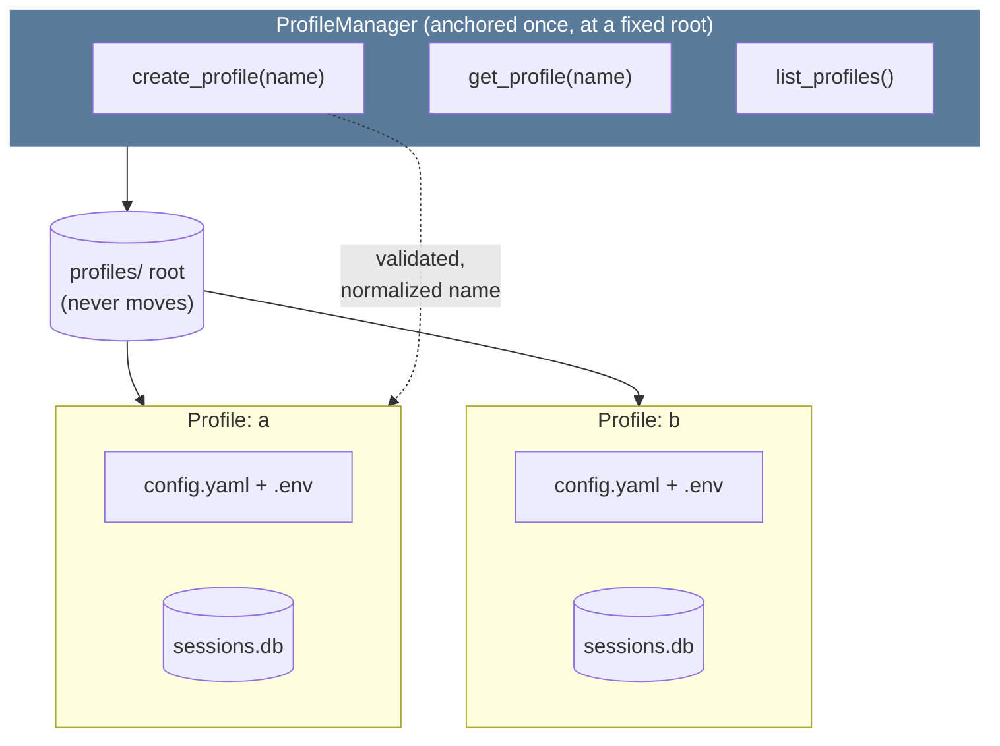
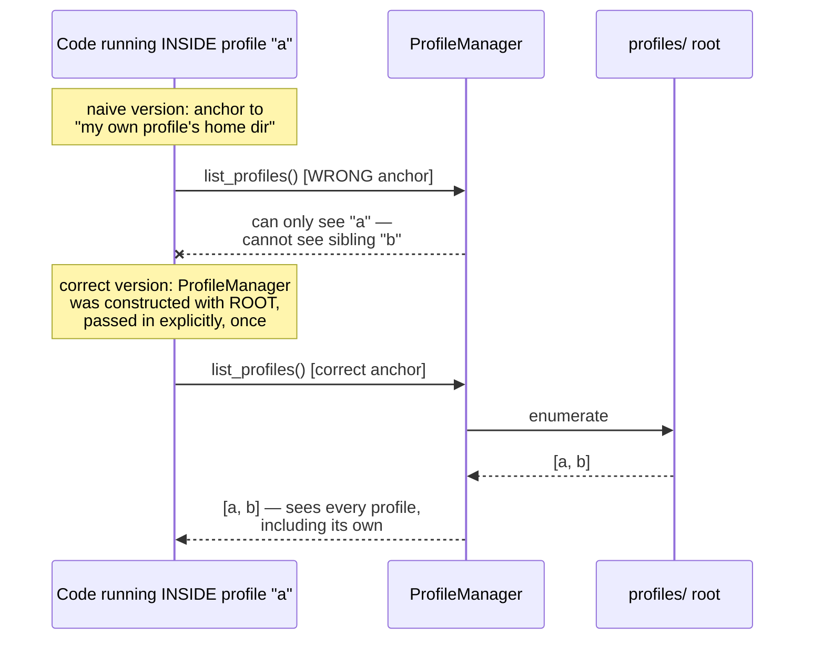

# 06 — Profiles (Identity Isolation)

**Problem this subsystem solves:** the engine must support more than one
agent identity existing on the same machine WITHOUT their state,
credentials, or memory bleeding into each other — this is the mechanism
that makes "add a new agent later" safe by construction rather than by
discipline.

## Component diagram



**Reading this:** `MGR` is anchored to `ROOT` directly — never to
"whichever profile happens to be currently active." This is the exact
fix for a real scoping trap (see Engineering Judgment below).

## Sequence diagram — the anchoring trap, avoided



## Interface

```python
@dataclass(frozen=True)
class Profile:
    name: str
    dir: Path
    config_path: Path
    session_db_path: Path

class ProfileManager:
    def __init__(self, root: Path): ...   # anchored ONCE, explicitly
    def create_profile(self, name: str) -> Profile: ...
    def get_profile(self, name: str) -> Profile: ...
    def list_profiles(self) -> list[Profile]: ...
```

## Engineering judgment

- **Full filesystem isolation is the default**, not a shared store
  filtered by a profile-id column. Failure-mode comparison:
  - *Shared DB + filter:* a forgotten `WHERE profile_id = ?` clause is
    VALID SQL that silently leaks data across profiles and passes every
    single-profile test. The bug is invisible until two profiles'
    actual data collides.
  - *Directory isolation:* the equivalent bug has to actively point at
    the WRONG PATH — a much more visible, harder-to-make-silently class
    of mistake.
  - This engine accepts the operational cost of more files on disk in
    exchange for that safety property. (Trade-off, not an absolute —
    shared-DB-with-filtering can be the right call at much larger scale;
    see `docs/standards/SECURITY.md` for the full reasoning.)
- **A manager that enumerates "all profiles" must be anchored above any
  single profile, never inside one.** See the sequence diagram above —
  this is a real, easy-to-introduce scoping bug this engine actively
  guards against in `ProfileManager`'s own constructor contract (root is
  passed in explicitly, once, never inferred from "the current
  context").
- **Profile names are untrusted input the moment they're accepted.** A
  name becomes a directory name and possibly a CLI/config argument —
  normalized (case-folding) and validated (reject empty, reject
  path-traversal characters, reject anything that would break shell/CLI
  quoting) BEFORE it ever touches the filesystem. This is the same
  blast-radius discipline as tool arguments (`03-TOOLS.md`) applied to a
  different kind of untrusted input.
- **One profile is correct when there is no real second identity to
  isolate from.** This engine does not default every deployment to
  multi-profile "just in case" — profiles exist because a genuine
  boundary (a second identity, a second client, a second isolated use
  case) is real, not because the capability exists.

## Cross-references

- Isolation as a SECURITY property (not just an organizational one):
  `docs/standards/SECURITY.md` §4.
- Each profile owns its own `SessionStore`: `05-SESSION-STORE.md`.
- Each profile owns its own config/secrets split: `07-CONFIG-SECRETS.md`.
- How a NEW profile gets created safely in production (the provisioning
  flow) is product-layer, specified in `docs/ARCHITECTURE.md` — this
  file only specifies the generic `create_profile()` mechanism it's
  built on.
