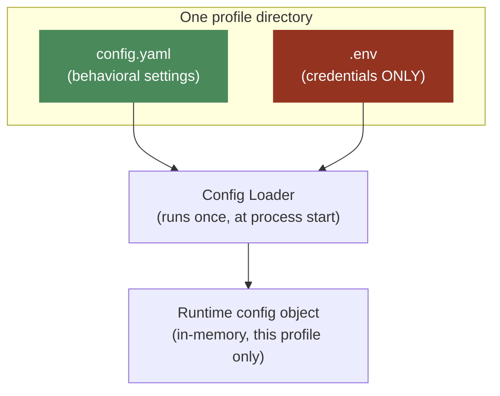
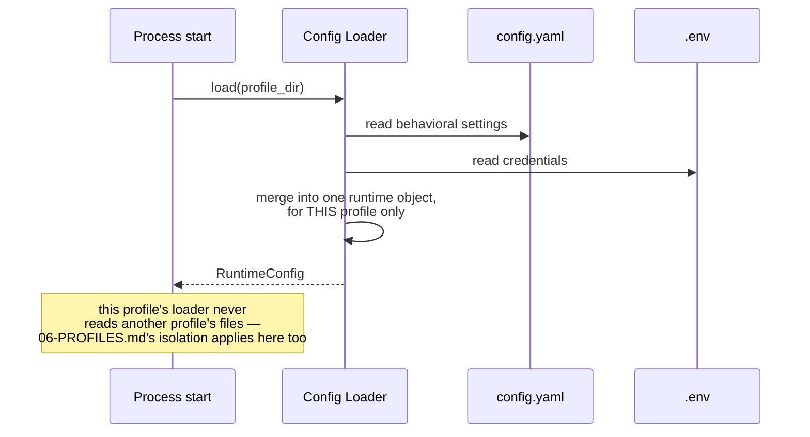

# 07 — Config & Secrets

**Problem this subsystem solves:** every profile needs its own behavioral
settings and its own credentials, without secrets ending up in version
control and without behavioral settings scattered across ad hoc
environment variables.

## Component diagram

**Reading this:** `.env` is colored as the highest-sensitivity box
deliberately — anything landing in it needs handling discipline that
`config.yaml` content does not.

## The split, and why it's load-bearing

| | `config.yaml` | `.env` |
|---|---|---|
| Contains | timeouts, thresholds, feature flags, which tools/channels are enabled, cost ceilings | API keys, tokens, passwords — credentials ONLY |
| Safe to commit/review in git? | Yes | **Never** |
| Safe to log/display in a debug dump? | Yes | **Never** |
| Failure mode if leaked | Non-event (a feature flag is not sensitive) | A real incident |

**Rule:** a setting that could be the subject of a code review comment
("should this timeout be 30s or 60s?") belongs in `config.yaml`. A
setting that unlocks access to something belongs in `.env`. Mixing them
makes both harder to handle correctly — `config.yaml` can be freely
shared for debugging; `.env` must never be.

## Sequence diagram — process start

## Cross-references

- Per-run and per-profile cost ceilings are `config.yaml` entries, read
  by this loader: `docs/standards/COST.md` §3.
- Operator deny-list entries (temporarily blocked recipients/franchises)
  are `config.yaml` entries, checked at the same gate as the code-level
  hardline list: `docs/standards/SECURITY.md` §3.
- Why this loader never reaches across profiles: `06-PROFILES.md`.
