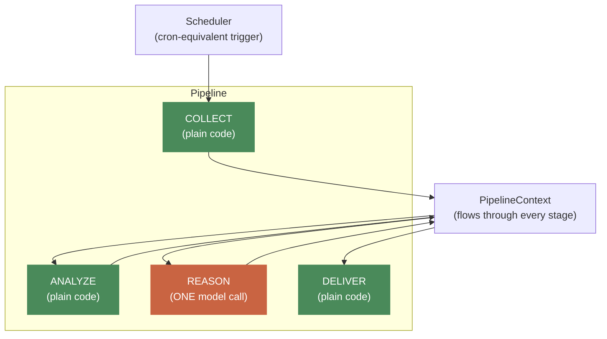
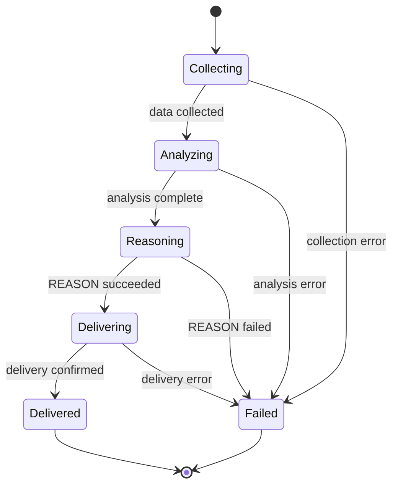
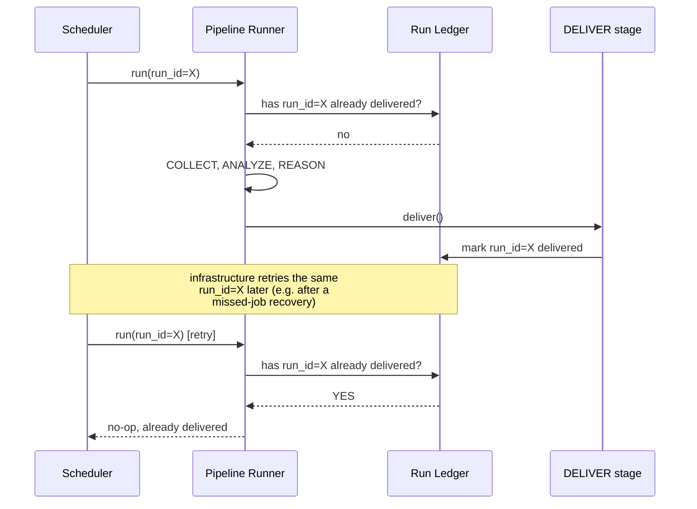

# 08 — Pipeline & Scheduler

**Problem this subsystem solves:** most of an agent's real work is NOT a
free-form conversation — it's scheduled or event-triggered, and should
minimize non-deterministic (model-dependent) steps for cost, reliability,
and auditability.

## Component diagram



**Reading this:** three of the four stages are green (deterministic,
zero model tokens, by construction). Exactly one is orange (the single
point of non-determinism and the single point of model cost). This
coloring is the whole cost/reliability argument for this subsystem in
one glance — see `docs/standards/COST.md` §1.

## State diagram — a run's lifecycle, including failure



**Hard rule tied to this diagram:** there is no path from `Reasoning` or
earlier directly to `Delivered` — `Delivering` always sits between a
successful `Reasoning` and `Delivered`. A failed `Reasoning` can only
reach `Failed`, never a partial `Delivering`. This is the "no partial
delivery, ever" rule, enforced structurally by the state machine, not
just stated as a principle.

## Sequence diagram — idempotent re-run



## Interface

```python
@dataclass
class PipelineContext:
    scope_id: str | None     # e.g. which profile/agent-instance this run is for; None if not scoped
    run_id: str
    started_at: float
    data: dict                # stage-to-stage payload, grows as stages run
    errors: list[str]         # non-fatal issues surfaced to DELIVER

class PipelineStage(Protocol):
    def run(self, context: PipelineContext) -> PipelineContext: ...

class Pipeline:
    stages: list[PipelineStage]
    def run(self) -> PipelineContext: ...
```

## Engineering judgment

- **The proven shape is COLLECT → ANALYZE → REASON → DELIVER**, with
  exactly ONE model call. This is deliberate: minimizing non-deterministic
  steps makes a pipeline's behavior auditable, its cost predictable, and
  its failures debuggable — you can always tell whether a bad output came
  from bad DATA (COLLECT/ANALYZE) or bad REASONING (REASON). Multi-model-
  call pipelines are avoided unless a real, specific need justifies the
  added non-determinism.
- **A failed REASON must never produce a partial DELIVER.** Enforced by
  the state machine shape above, not just a convention.
- **REASON's output is schema-constrained and hard-ruled against
  fabrication** — every REASON prompt enforces "never invent a value not
  present in ANALYZE's output," and where applicable, "default to
  no-match/no-confidence unless there is real evidence." This is an
  engine-level convention every pipeline follows, not something each
  agent reinvents per prompt.
- **Idempotent re-runs by `run_id`.** See the sequence diagram above —
  this matters specifically because pipelines run UNATTENDED and may be
  retried by infrastructure outside the agent's own control (a scheduler
  recovering a missed job), a failure mode a human-driven chat session
  doesn't have in the same way.
- **The runner is a thin scheduler** (cron-equivalent + an event trigger
  for non-scheduled runs) — it does not grow business logic of its own;
  COLLECT/ANALYZE/REASON/DELIVER content is entirely supplied by whatever
  agent registers a pipeline.

## Cross-references

- Full cost reasoning for this shape: `docs/standards/COST.md` §1, §3.
- Full failure classification and recovery per stage:
  `docs/standards/RELIABILITY.md`.
- Structured per-run observability records: `docs/standards/OBSERVABILITY.md` §1.
- Why REASON needs no compression machinery (bounded by construction):
  `docs/standards/CONTEXT_MANAGEMENT.md`.
