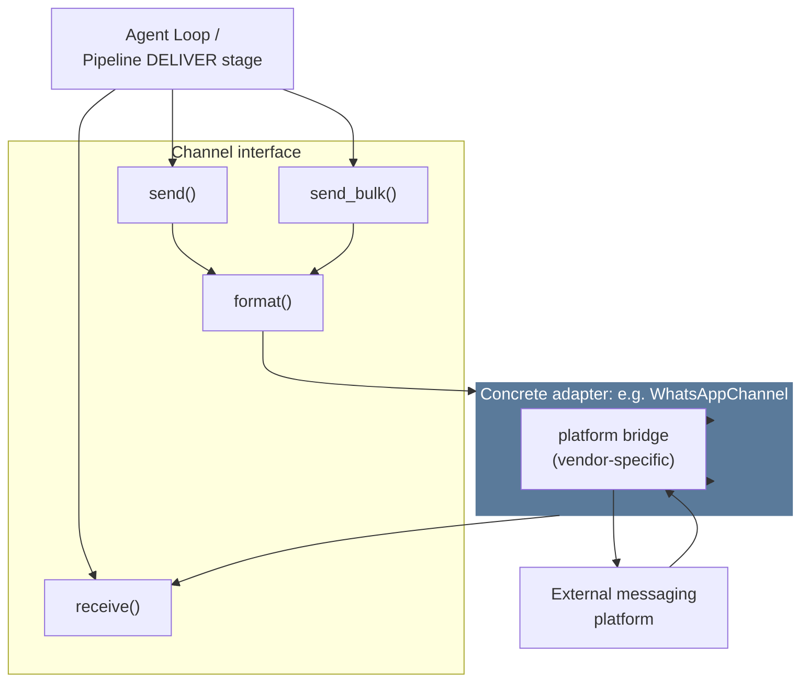
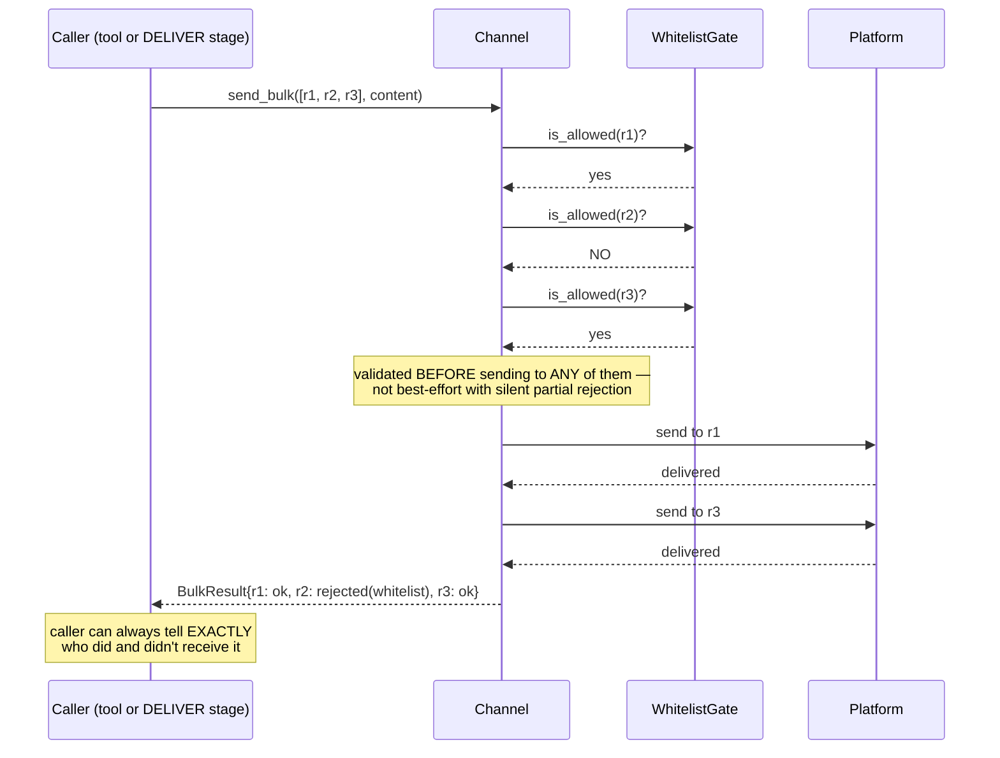

# 09 — Channels

**Problem this subsystem solves:** an agent needs to receive and send
messages through some external surface (messaging platform, email,
webhook) — the loop and pipeline runner must not be coupled to which one.

## Component diagram



## Sequence diagram — a bulk send with per-recipient reporting



## Interface

```python
class Channel(Protocol):
    def receive(self) -> NormalizedMessage: ...
    def send(self, chat_id: str, content: str) -> SendResult: ...
    def send_bulk(self, chat_ids: list[str], content: str) -> BulkResult: ...
    def format(self, markdown: str) -> str: ...
```

## Engineering judgment

- **`format()` is its own method, not inlined into `send()`**, because
  markdown-to-platform-native conversion is real, non-trivial,
  independently-testable logic (real bold vs. literal asterisks, heading
  structure, platform-specific limits) — reused identically across
  `send` and `send_bulk` rather than duplicated or drifting between them.
- **`send_bulk` is NOT a separate code path reimplementing delivery** —
  it's `send` applied per-recipient, with WHITELIST VALIDATION happening
  for every recipient BEFORE any message goes out to any of them (see
  sequence diagram), and explicit PER-RECIPIENT success/failure
  reporting — never a silent partial failure a caller can't see.
- **A new channel is one new class implementing this interface.** The
  loop, the pipeline runner, and every existing agent remain completely
  unaware a new channel was added — this is the concrete proof of the
  "add capability without touching the engine" promise for the
  reachability dimension specifically.

## Cross-references

- `WhitelistGate` contract (checked here, specified fully in):
  `10-ACCESS-CONTROL.md`.
- Why whitelist validation happens at THIS boundary, not just as prompt
  guidance: `docs/standards/SECURITY.md` §1.2.
