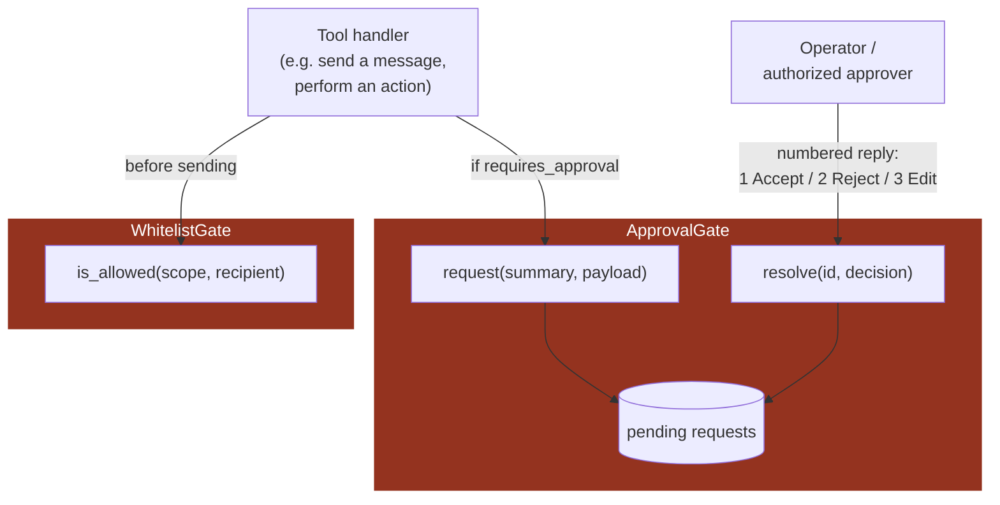

# 10 — Access Control (Whitelist + Human Approval)

**Problem this subsystem solves:** some tool executions are consequential
enough that they must be restricted to authorized recipients and/or
require human sign-off before they run — enforced centrally, once, not
reimplemented per tool.

## Component diagram



**Both gates colored as highest-sensitivity** — they are the last line
of defense before a real-world, possibly-irreversible effect happens.

## Sequence diagram — full gated execution

```mermaid
sequenceDiagram
    participant REG as ToolRegistry
    participant WL as WhitelistGate
    participant AP as ApprovalGate
    participant HUMAN as Operator
    participant TOOL as Tool handler

    REG->>WL: is_allowed(scope, recipient)?
    alt not allowed
        WL-->>REG: false
        REG-->>REG: reject, never reaches TOOL
    else allowed
        WL-->>REG: true
        alt tool.requires_approval
            REG->>AP: request(summary, payload)
            AP-->>REG: request_id (pending)
            Note over AP,HUMAN: run pauses; a real human<br/>must reply before continuing
            HUMAN->>AP: "1" (accept)
            AP->>AP: resolve(request_id, accept)
        end
        REG->>TOOL: execute
        TOOL-->>REG: result
    end
```

## Interface

```python
class WhitelistGate:
    def is_allowed(self, scope: str, recipient_id: str) -> bool: ...

class ApprovalGate:
    def request(self, scope: str, summary: str, payload: dict) -> ApprovalRequestId: ...
    def resolve(self, request_id: ApprovalRequestId,
                decision: Literal["accept", "reject", "edit"],
                edit_payload: dict | None = None) -> None: ...
```

## Engineering judgment

- **Checked at the TOOL EXECUTION boundary, inside the handler — never
  only as prompt guidance the model is trusted to honor.** This is the
  blast-radius principle (`03-TOOLS.md`) applied concretely: an
  untrusted-origin decision (the model deciding to call a tool) is
  re-validated at the exact point where real-world effect happens, not
  assumed safe because the prompt said to be careful.
- **`ApprovalGate` is a generic mechanism any tool opts into via
  `requires_approval=True` at registration** (`03-TOOLS.md`) — not a
  special case wired into one agent's code. A so-flagged tool NEVER
  executes directly; it always routes through `request()` first, and
  only a matching `resolve(..., "accept")` lets it run.
- **The numbered-reply flow (1=Accept/2=Reject/3=Edit) is a proven UX
  pattern** for a messaging channel with no native interactive buttons —
  reused here rather than reinvented per agent.
- **Rejection and timeout are first-class outcomes, not edge cases.** A
  request that's rejected or never resolved must leave the pipeline/tool
  call in a clearly terminal state (not silently retried, not silently
  treated as accepted) — see `docs/standards/RELIABILITY.md` for how an
  unresolved approval interacts with a pipeline's overall run status.

## Cross-references

- The full blast-radius tier table that decides which tools MUST have
  these gates (non-configurable): `docs/standards/SECURITY.md` §2.
- How `WhitelistGate` is checked inside `Channel.send_bulk`:
  `09-CHANNELS.md`.
- The hardline/deny-list layer that sits ALONGSIDE these two gates as
  additional defense-in-depth: `docs/standards/SECURITY.md` §3, §6.
