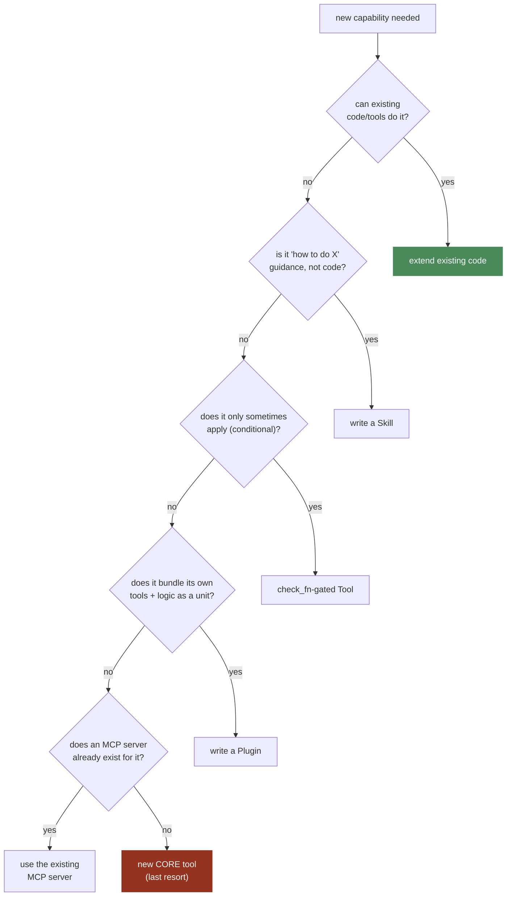
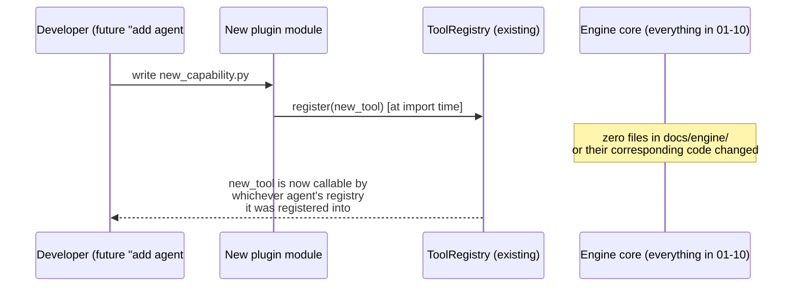

# 11 — Extensibility (Skills, Plugins, MCP)

**Problem this subsystem solves:** new capability must be addable at the
EDGES of the engine, without growing the core loop or its always-sent
tool schemas (`03-TOOLS.md`'s footprint cost is real and recurring).

## Component diagram — the footprint ladder

**Reading this:** the ladder is a decision tree, not a menu — walk it
top to bottom, stop at the first "yes." The last rung is colored red
deliberately: it's the most expensive option (paid for on every single
model call, forever, per `03-TOOLS.md`) and should be rare.

## The three mechanisms, precisely

- **Skills** — markdown procedural knowledge, loaded into context ON
  DEMAND (by keyword/explicit reference), not compiled into code and not
  a permanent tool-schema cost. Used for "how to do X" guidance an agent
  should follow without that guidance costing a permanent slot in the
  core tool schema.
- **Plugins** — Python modules that register new tools/adapters at
  startup, through the SAME `ToolRegistry`/`Channel` interfaces already
  specified in `03-TOOLS.md`/`09-CHANNELS.md`. A plugin never reaches
  into the loop's internals — it only ever calls the same `register()`
  entry points any other tool/channel uses.
- **MCP (Model Context Protocol)** — treated as a "buy," not a "build":
  for an integration where an existing MCP server already exists, use
  the official client rather than hand-writing the integration. Only
  hand-write a plain `Tool` when no MCP server exists for that need.

## Sequence diagram — adding capability without touching the engine

**This diagram is the direct, concrete proof of the standing requirement
that drove this whole document set: a new agent is a new plugin/profile/
prompt — never a change to the engine itself.**

## Cross-references

- The registry this all plugs into: `03-TOOLS.md`.
- The channel interface plugins can also extend: `09-CHANNELS.md`.
- Why the ladder exists (recurring token cost of every core tool):
  `docs/standards/COST.md` §2.1 and `03-TOOLS.md`'s footprint discussion.
