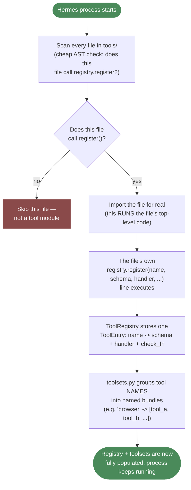

# Day 2, Component 2 — Tool Registry: The Big Picture (Hermes's real system, explained first)

This file is the CONCEPTUAL walkthrough of how Hermes's real tool
system works end-to-end, written before any of our own code — same
discipline as every other component: understand the real mechanism
first, ground every later design decision in it, build second.

Grounded in real Hermes source, verified by reading the actual files,
not assumed: `/home/ubuntu/.hermes/hermes-agent/tools/registry.py`
(1,335 lines), `tools/approval.py` (5,498 lines), `toolsets.py`
(1,083 lines), and real individual tool files like
`tools/computer_use_tool.py` and `tools/close_terminal_tool.py`.

---

## The big picture — 4 layers, in order

**1. DEFINE** — each tool file (`tools/*.py`) has three things: a
Python function (what it actually does), a `SCHEMA` dict
(name/description/parameters — this is literally what gets sent to the
model so it knows the tool exists), and a `registry.register(...)`
call at the bottom of the file.

**2. DISCOVER** — on startup, Hermes scans every file in `tools/`,
checks (via a cheap AST scan, not importing) whether it calls
`registry.register(...)`, and only imports the ones that do. Importing
the file is what ACTUALLY runs that `register()` call and adds it to
the registry.

**3. REGISTRY** (`ToolRegistry`, a singleton) — one big dict:
`name → ToolEntry` (schema + handler function + an optional `check_fn`
+ metadata). It's the single source of truth for "what tools exist and
how to run them." Nothing else holds a second copy.

**4. TOOLSETS** — tools are grouped into named bundles (e.g.
`"browser"`, `"terminal"`). A toolset is just a label; the registry
still holds every individual tool. Toolsets exist so a profile/session
can say "give me the `browser` bundle" instead of listing 15 tool names
by hand.

## The flow — tying this to what you already know: "function creation" vs "function calling"

You already know the two real phases every tool-calling system has:
**creating** the function (defining it, once) and **calling** it
(the model deciding to use it, at runtime, possibly many times). The 4
layers above map directly onto those two phases — layers 1-3 ALL
happen during "creation" (at startup, before the model is ever talked
to), and the "two moments" section happens during "calling" (while a
real conversation is running). Nothing in layers 1-3 happens more than
once per process; the calling-phase steps happen over and over, once
per model turn.

### Phase A (creation, happens ONCE, at startup) — layers 1, 2, 3, 4 in sequence



**This whole diagram is "function creation," stretched across all 4
layers.** By the time it finishes, nothing has talked to a model yet —
the registry is just a populated dictionary, sitting there, waiting.

### Phase B (calling, happens EVERY model turn, repeatedly, while the process runs)

```mermaid
sequenceDiagram
    participant LOOP as Agent Loop
    participant REG as ToolRegistry
    participant MODEL as The Model (API)
    participant HANDLER as Tool's handler function

    Note over LOOP,REG: --- Moment 1: before every model call ---
    LOOP->>REG: get_definitions(["browser", "terminal", ...])
    REG->>REG: for each name: run check_fn() (cached ~30s)<br/>drop any tool that's unavailable right now
    REG-->>LOOP: [{"type":"function","function":{schema}}, ...]
    LOOP->>MODEL: send messages + this tool schema list
    MODEL-->>LOOP: "I want to call tool X with args {...}"

    Note over LOOP,HANDLER: --- Moment 2: only if the model asked to call a tool ---
    LOOP->>REG: dispatch("X", {args})
    REG->>REG: look up ToolEntry by name "X"
    REG->>HANDLER: entry.handler(args)
    HANDLER-->>REG: real result (or raises an exception)
    REG->>REG: normalize result to a string,<br/>or catch the exception -> {"error": "..."}
    REG-->>LOOP: the tool's result
    LOOP->>MODEL: send the result back as a new message
    Note over LOOP,MODEL: loop continues - model may call<br/>another tool, or give a final answer
```

**This is "function calling," and it's a LOOP, not a one-time event.**
Moment 1 happens before every single request to the model (the model
needs to be told, EVERY time, what tools exist right now — this is why
`check_fn` results are cached for ~30 seconds instead of recomputed on
every single call, which would be wasteful). Moment 2 only happens
when the model's response says "call this tool" — on a turn where the
model just answers in plain text, moment 2 never happens at all.

**The one sentence that ties the whole file together:** creation
(layers 1-4) builds ONE registry, ONCE; calling (the two moments)
reads from that SAME registry, MANY times, once per model turn, for
the entire lifetime of the process.

## The two moments the registry actually gets used

- **`get_definitions(tool_names)`** — called once per model request.
  Walks the requested names, skips any whose `check_fn()` says "not
  available right now" (e.g. browser tool but playwright isn't
  installed), and returns the OpenAI-format schema list that actually
  gets sent to the model.
- **`dispatch(name, args)`** — called when the model asks to USE a
  tool. Looks up the entry, calls `entry.handler(args)`, catches every
  exception and turns it into a clean `{"error": ...}` string instead
  of crashing, so a buggy tool never kills the conversation.

## The one engineering idea underneath all of it

**A tool is just data (schema) + a function (handler), registered
once, looked up by name everywhere else.** Nothing else in the system
(the loop, the model call, the UI) needs to know HOW a tool works —
only that it has a name, a schema, and something callable. `check_fn`
is the one clever addition: it lets a tool be REGISTERED (exists) but
conditionally HIDDEN from the model (not available right now) — e.g.
don't offer the browser tool if the browser binary isn't installed —
without having to register/deregister tools dynamically.

---

## How OTHER real harnesses do this — the same problem, two very different shapes

Hermes solves "how does the model know what tools exist, and how does
a tool call actually run" with a GLOBAL SINGLETON REGISTRY. That's one
real design — but not the only one. Two other real, production
harnesses were installed and their actual source code read (not
described secondhand) to see how differently this same problem can be
solved: **OpenAI's own Agents SDK** (`pip install openai-agents`,
package `agents`) and **LangChain's `deepagents`** (built on
`langchain_core.tools.BaseTool`).

### OpenAI Agents SDK — NO global registry at all; tools live on the agent object itself

**Real source, read directly:**
`agents/tool.py` (2,980 lines) and `agents/agent.py`, from the
installed `openai-agents` package.

```python
@dataclass
class Agent(AgentBase, Generic[TContext]):
    name: str
    tools: list[Tool] = field(default_factory=list)
    mcp_servers: list[MCPServer] = field(default_factory=list)

    async def get_all_tools(self, run_context):
        """All agent tools, including MCP tools and function tools."""
        tools = snapshot_agent_tools(self)
        mcp_tools = await self.get_mcp_tools(run_context)
        # ... filters by is_enabled, dedupes, returns the final list
```

**The real shape:** a tool here is a `FunctionTool` dataclass — `name`,
`description`, `params_json_schema`, and a callable (`on_invoke_tool`)
— built either by hand or via the `@function_tool` decorator, which
auto-generates the JSON schema straight from the Python function's own
type hints and docstring. There is **no central place these tools get
registered into.** Instead, each individual `Agent` object simply
HOLDS its own `tools: list[Tool]` directly as a field. "What tools does
this agent have" is answered by just reading `agent.tools` — there's
no lookup-by-name step at all for the basic case.

**The one mechanism that plays a SIMILAR role to Hermes's `check_fn`:**
`FunctionTool.is_enabled` — either a plain `bool`, or a callable that
takes the run context and the agent and decides dynamically. Read
`get_all_tools()` above: it calls this for every tool on every run and
filters the list down to only the enabled ones before returning it to
the model. Same IDEA as `check_fn` (a tool can exist but be
conditionally hidden), but the mechanism lives on the tool object
itself, not inside a separate global dictionary that has to be
consulted.

**The real tradeoff this implies:** Hermes's registry answers "what
tools exist, globally, across the whole process" with one shared,
queryable object — useful when MANY different sessions/profiles need
to pick different SUBSETS of a large shared pool of built-in tools
(exactly Hermes's real situation: ~100+ built-in tool files, bundled
into toolsets, enabled per-profile). The Agents SDK's per-agent `tools`
list fits a different real shape: each `Agent` is typically built
fresh, in code, with an explicit, usually SMALL list of tools chosen
right there at construction time — there's no large shared pool to
pick subsets FROM in the first place, so a central registry would be
solving a problem that doesn't really exist in that usage pattern.

### LangChain / deepagents — tools are first-class OBJECTS (`BaseTool`), not dict entries

**Real source, read directly:**
`langchain_core/tools/base.py` and `deepagents/graph.py`, from the
installed `deepagents` package (built on top of `langchain.agents`).

```python
class BaseTool(RunnableSerializable[...]):
    name: str
    description: str
    args_schema: Type[BaseModel] | None = Field(...)

    def invoke(self, input, ...): ...
    def run(self, ...): ...
    def _run(self, *args, **kwargs): ...  # subclasses implement this
```

**The real shape:** `BaseTool` is a genuine CLASS, not a schema dict
plus a separately-tracked handler function — the schema
(`args_schema`, a real Pydantic model, not a hand-written JSON dict)
and the execution logic (`_run`) live on the SAME object, as methods.
The `@tool` decorator (`langchain_core.tools.tool`) is the equivalent
of Hermes's "write a schema dict + a handler function" step — it
builds a `BaseTool` instance out of a plain Python function
automatically, inferring the schema from type hints exactly like the
Agents SDK's `@function_tool` does.

**How `deepagents` actually "registers" tools, confirmed by reading
`graph.py` directly:** `create_deep_agent(tools=[...])` — you just pass
a plain Python LIST of `BaseTool` objects (or plain functions, which
get auto-wrapped) straight into the agent constructor. No discovery
step, no scanning a directory, no central dict anyone queries by name.
Deepagents adds its OWN tools (a planning tool, filesystem tools,
sub-agent delegation) by literally concatenating them onto this same
list before building the underlying LangGraph graph.

**The real tradeoff this implies:** Pydantic models for `args_schema`
buy real, automatic input VALIDATION (type-checking, required fields)
essentially for free, as a side effect of using a real class and a
real schema library — something Hermes's raw-dict schemas don't get
automatically; Hermes validates each tool's own arguments by hand,
inside each handler function. The cost on LangChain's side is a
genuine dependency on Pydantic and LangChain's own class hierarchy
being present at all — Hermes's dict-based `ToolEntry` has zero
framework dependency, which matches AGENTS.md's own stated philosophy
("no agent framework," something this project's own `docs/STACK.md`
deliberately mirrors for the same reason).

### The real underlying pattern, now visible across all three

Every single one of these three real, production harnesses reduces a
"tool" down to the exact same two irreducible pieces, no matter how
differently they're PACKAGED:

| | Hermes | OpenAI Agents SDK | LangChain / deepagents |
|---|---|---|---|
| **The "what it is" fact** | a plain JSON `schema` dict | `FunctionTool.params_json_schema` (dict) | `BaseTool.args_schema` (a real Pydantic class) |
| **The "how to run it" fact** | a separately-tracked `handler` function | `on_invoke_tool` (a method ON the same object) | `_run()` (a method ON the same object) |
| **Where both live together** | `ToolEntry` — one dict ENTRY, schema+handler stored as separate fields | `FunctionTool` — one dataclass, schema+handler as fields | `BaseTool` — one real CLASS, schema+execution as inherited methods |
| **"is this available right now?"** | `check_fn` — a separate callable, consulted by the registry | `is_enabled` — a field ON the tool itself | not a first-class concept at this layer — handled by which tools you choose to pass in |
| **Where the list of "what's offered" lives** | the registry (queried by name, separate from any one agent) | `agent.tools` (a plain list, owned by that ONE agent) | the list passed into `create_agent(tools=[...])` (owned by that ONE graph) |

**The one real, portable lesson, independent of which shape a given
harness picked:** every tool, in every one of these systems, is
reducible to exactly two facts — "what it looks like to the model"
(a schema) and "what actually happens when it's called" (a function).
Everything else — a global registry vs. a per-agent list,
dict-based vs. class-based, `check_fn` vs. `is_enabled` — is a
packaging decision layered on top of that same fixed pair, chosen to
fit each project's own real usage shape (a large shared pool of
built-in tools needing per-profile subsetting, vs. a small
explicitly-constructed list per agent, vs. a framework that wants
automatic schema validation for free).

---

## Next

This is the conceptual skeleton only — nothing has been built yet for
our own engine. Follow-up topics to go deeper on before (or while)
designing our own `ToolRegistry`:
- `check_fn` mechanics in detail (caching, TTL, what triggers a
  re-check).
- The discovery/caching mechanics (the mtime+size cache that avoids
  re-scanning every file on every startup).
- Toolsets vs. registry — exactly how a toolset "bundle" resolves down
  to individual tool names (`resolve_toolset`, aliasing, nesting).
- The approval/blast-radius layer (`tools/approval.py`) — a separate,
  much larger concern layered on top of dispatch, not part of the core
  registry itself.
- Which real shape (global registry, per-agent list, or class-based
  tool objects) actually fits THIS project's own real usage pattern —
  informed by the cross-harness comparison above, not decided before
  seeing it.
