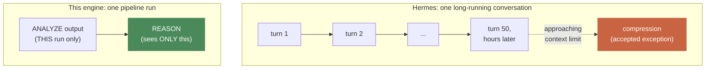
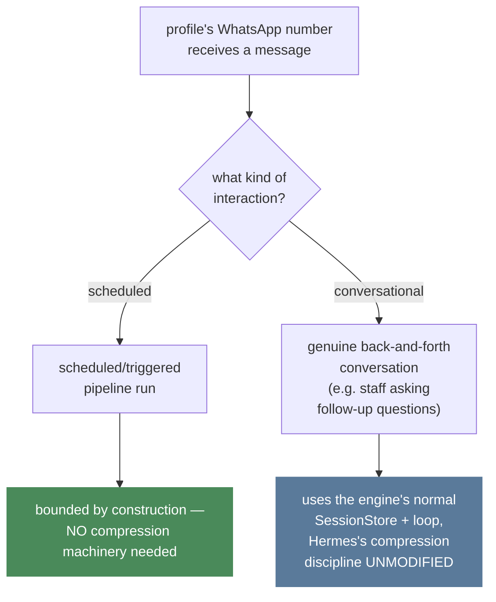
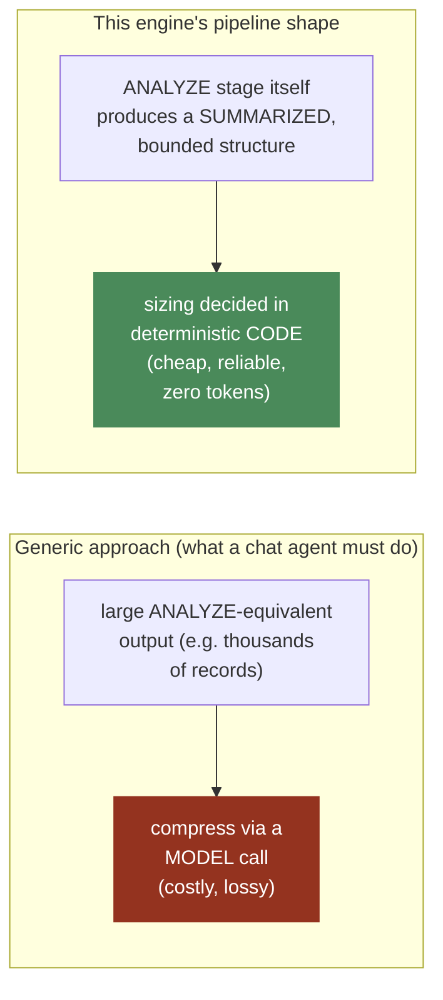

# Context Management

**This is the one standard explicitly NOT copying Hermes by default** —
reasoned from first principles, per the explicit instruction to think
carefully here rather than blindly mirror Hermes's approach. Hermes's
context-management problem and this engine's are genuinely different in
shape, and the right design follows from that difference, not from
"match Hermes."

## Hermes's actual problem

A single Hermes conversation can run for hours or days, accumulate a
large tool-call history, and must use compression (the one accepted
cache-breaking exception,
`docs/engine/04-SYSTEM-PROMPT.md`) to stay within a model's context
window while preserving enough history for the conversation to stay
coherent to the human who's been chatting the whole time.

## Why most of this engine's workload does NOT have that problem

**A pipeline run's REASON stage** (`docs/engine/08-PIPELINE-SCHEDULER.md`)
**receives exactly ONE thing as its context: that run's own ANALYZE
output — not a growing conversation history.** There is no multi-hour
accumulation to compress, because there is no multi-hour conversation.
Each run is bounded BY CONSTRUCTION, not by a compression strategy
applied after the fact.

## Where Hermes's real problem — and real solution — DOES apply here

**The distinction, stated as a rule:** pipeline runs (scheduled,
bounded) need NO compression strategy at all. Conversational sessions
(user-initiated, open-ended — using the normal agent loop and
`SessionStore` from `docs/engine/01-AGENT-LOOP.md`/`05-SESSION-STORE.md`)
get Hermes's full, proven compression discipline, UNMODIFIED, because at
that point we genuinely have Hermes's exact problem, and Hermes already
solved it well. This is not "do it exactly like Hermes" applied
uniformly — it's "recognize which code path actually has Hermes's
problem, and only apply Hermes's solution there."

## Where this engine can do BETTER than a generic compression strategy

When a pipeline's ANALYZE output itself is very large (e.g. an agent
instance with thousands of records to analyze), the right move is NOT
"compress it the way a long chat gets compressed" — it's "ANALYZE should
already be producing a SUMMARIZED, bounded structure as its OWN output,
sized for exactly what REASON needs to reason about." This pushes the
context-sizing problem UPSTREAM into deterministic code (cheap,
reliable, zero tokens, see `docs/standards/COST.md` §1) instead of
DOWNSTREAM into the model (expensive, lossy).

**This is a real, available optimization specific to our pipeline shape
that a general chat agent structurally cannot take** — Hermes doesn't
control the shape of what's being discussed in an open-ended
conversation the way our own ANALYZE stage controls exactly what REASON
sees. We have a design lever Hermes doesn't have, and this is where we
genuinely do better, not just "the same but cheaper."

## The rule, stated plainly

Context management for this engine is a decision made PER CODE PATH, not
one global strategy:

1. **Bounded pipeline runs** → bounded-by-design context. No compression
   machinery. If ANALYZE's output is too large, fix ANALYZE's
   summarization logic (deterministic code), not REASON's prompt
   handling.
2. **Genuine conversational sessions** → Hermes's proven compression
   discipline, unmodified, because the problem really is the same
   problem at that point.

## Cross-references

- The system prompt's own caching rules (compression is the one
  accepted exception there too): `docs/engine/04-SYSTEM-PROMPT.md`.
- The pipeline shape that makes most work bounded by construction:
  `docs/engine/08-PIPELINE-SCHEDULER.md`.
- Session store and the normal agent loop, used for genuine
  conversations: `docs/engine/01-AGENT-LOOP.md`,
  `docs/engine/05-SESSION-STORE.md`.
