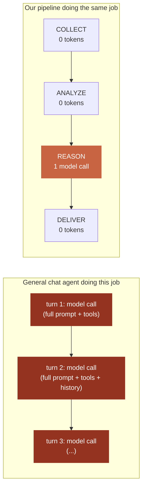
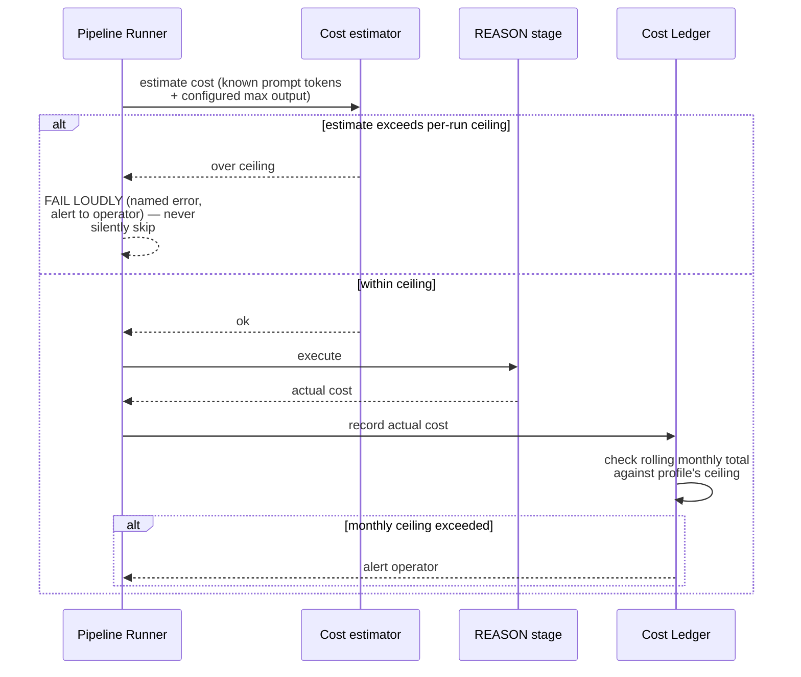
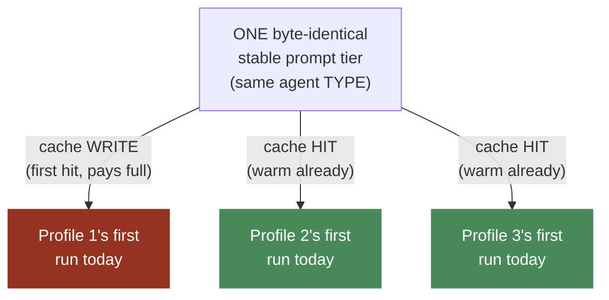

# Cost Management

**This is an ENGINE-level standard.** Grounded in Hermes's real
`state.db` session-cost columns and prompt-caching discipline, extended
with mechanisms Hermes's own workload shape doesn't need but ours does.

## 1. Why the pipeline shape is structurally cheaper for the same work

**This is not a trick — it's that most of "generate a report" is data
transformation, not reasoning**, and the pipeline shape
(`docs/engine/08-PIPELINE-SCHEDULER.md`) only pays for the part that
actually requires a model. A general chat agent doing the equivalent
multi-step task pays the full prompt+tools+history cost on every
exchange along the way.

## 2. A real per-run cost ledger, modeled on Hermes's own

Hermes's `state.db` tracks, per session: `input_tokens`,
`output_tokens`, `cache_read_tokens`, `cache_write_tokens`,
`actual_cost_usd`, `cost_status` (`estimated`/confirmed),
`pricing_version`.

**We adopt the same fields, per PIPELINE RUN** (not per chat session,
since our unit of work is a run, not an open-ended conversation) — cheap
to add to an existing run record, and gives us the same after-the-fact
auditability Hermes has: what every run actually cost, not just a
dashboard assumption.

## 3. What goes beyond Hermes: a proactive cost ceiling

**Why this is genuinely new engineering, not a copy of Hermes:** Hermes
is built for a human actively driving a conversation — a runaway cost is
visible to that human in real time, and they can stop it. Our pipelines
run UNATTENDED (cron-triggered), potentially across many profiles at
once. A cost ceiling must be enforced PROACTIVELY (before the call), not
just logged for later review — because there is structurally no human
watching in real time to catch it otherwise.

**Two ceiling levels:**
- **Per-run ceiling:** estimated before the REASON call executes; a run
  that would exceed it fails loudly instead of running.
- **Rolling per-profile monthly ceiling:** sum of actual costs from §2;
  triggers an alert, and optionally a hard stop, before the bill does.

## 4. Prompt caching discipline — identical to Hermes, non-negotiable

`docs/engine/04-SYSTEM-PROMPT.md`'s caching rules apply without
modification: stable tier first, volatile tier last, never rebuilt
mid-conversation.

**One addition specific to our multi-profile shape:**

Because every profile running the SAME agent type shares the exact same
stable prompt tier (`docs/ARCHITECTURE.md` §5), the FIRST profile's run
in a time window effectively "pays" the cache-write cost, and every
SUBSEQUENT profile's run in the same window hits a warm cache for that
shared prefix. This is a real, structural cost benefit — a careless
per-profile prompt customization (baking profile-specific data into the
stable tier) would silently destroy it. See
`docs/engine/04-SYSTEM-PROMPT.md`'s rule that profile-specific data
belongs in the volatile tier.

## Cross-references

- Pipeline shape this all depends on: `docs/engine/08-PIPELINE-SCHEDULER.md`.
- System prompt tiering mechanics: `docs/engine/04-SYSTEM-PROMPT.md`.
- Session-store size ceilings as a related cost control:
  `docs/engine/05-SESSION-STORE.md`.
- Observability of actual vs. estimated cost: `OBSERVABILITY.md` §1.
