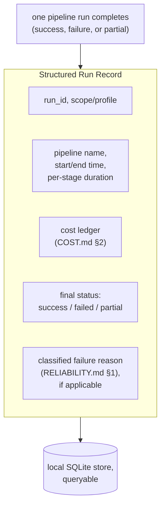
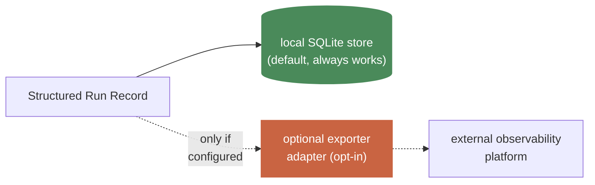

# Observability

**This is an ENGINE-level standard.** Grounded in Hermes's real
`docs/observability/` (monitoring docs, OpenTelemetry integration) and
its own stated rule that third-party integrations stay opt-in, never a
hard dependency.

## 1. Structured per-run records, not scattered logs

**Why this matters concretely:** "show me every failed run for profile X
this week" should be one query against structured records, never a grep
through scattered log lines. This is the direct operational payoff of
treating observability as a first-class data shape, not an afterthought
bolted onto logging.

## 2. No third-party observability SaaS baked into the engine core

Hermes's own stated rule (quoted in `docs/ARCHITECTURE.md`'s original
grounding): third-party observability/analytics backends are not core
dependencies — they're opt-in integrations at the edges (a
plugin/exporter), never something every deployment is forced to run or
pay for. **We adopt this directly:** the structured run record (§1) is
written locally by default (same SQLite-based discipline as
`docs/engine/05-SESSION-STORE.md`); exporting it to an external
observability platform is an optional adapter, not a hard dependency.

## 3. Profile/instance status as a first-class observability signal

The `pending_pairing` / `live` / `suspended` status field
(`docs/TECHNICAL_SPEC.md` §2) isn't just provisioning bookkeeping — it's
the first thing an operator should be able to query to answer "which
agent instances are actually operational right now," without needing to
inspect individual pipeline run history first.

## 4. What "good observability" means for THIS engine's shape, concretely

Because most work here is unattended (`docs/engine/08-PIPELINE-SCHEDULER.md`),
observability substitutes for the real-time human attention a chat agent
like Hermes naturally has. The bar is: an operator who was asleep when a
run happened should be able to reconstruct, from the structured record
alone, exactly what happened, what it cost, and why it failed if it did
— without needing to re-run anything or read raw logs.

## Cross-references

- Cost ledger fields that populate the structured record: `COST.md` §2.
- Classified failure reasons that populate the structured record:
  `RELIABILITY.md` §1.
- Where the local store lives: `docs/engine/05-SESSION-STORE.md`'s
  SQLite pattern, reused here.
