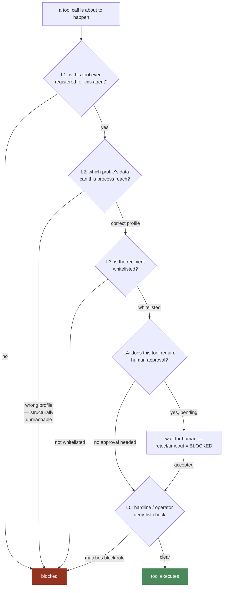

# Permissions Management

**This is an ENGINE-level standard.** Consolidates the permission
enforcement points that are each specified in detail elsewhere — this
file exists to show the FULL layered model as one coherent picture, so
it's reviewable as a whole rather than only discoverable by reading five
separate files.

## The full layering, as one diagram

**No single layer is trusted alone.** A tool that shouldn't exist for an
agent is caught at L1 before anything else matters. A profile-isolation
bug would need to defeat L2, which is enforced structurally (which
objects the process was constructed with), not by a runtime check that
could itself be buggy. A bad recipient is caught at L3. A consequential
action without sign-off is caught at L4. An operator-level override is
caught at L5. Each layer assumes the ones before it might fail — that
assumption is what makes this defense IN DEPTH rather than one check
with extra steps.

## Where each layer is actually specified

| Layer | Full specification |
|---|---|
| L1 — tool registration | `docs/engine/03-TOOLS.md`, `docs/standards/SECURITY.md` §1 |
| L2 — profile/data isolation | `docs/engine/06-PROFILES.md`, `docs/standards/SECURITY.md` §4 |
| L3 — recipient whitelist | `docs/engine/09-CHANNELS.md`, `docs/engine/10-ACCESS-CONTROL.md` |
| L4 — human approval | `docs/engine/10-ACCESS-CONTROL.md` |
| L5 — hardline + deny-list | `docs/standards/SECURITY.md` §3 |

## The one rule that governs all five layers

**Permission checks happen at the point of EXECUTION, never only as
prompt guidance the model is trusted to honor.** Every layer above is
code the model cannot talk its way around — not a sentence in the system
prompt asking it nicely to behave. This is the blast-radius principle
(`docs/engine/03-TOOLS.md`) applied as the organizing idea for this
entire file.

## Who decides WHAT each tier/whitelist/approval rule actually contains

This file specifies the MECHANISM (five layers, always checked, in this
order). The CONTENT of any specific rule (which tools get
`blast_radius: consequential_bulk`, which recipients are whitelisted for
a given profile, which tools require approval) is product-layer
configuration — specified per-agent in `docs/ARCHITECTURE.md` and set
per-profile in that profile's `config.yaml`
(`docs/engine/07-CONFIG-SECRETS.md`), never hardcoded into the engine
itself. This is what keeps the mechanism reusable for a future agent
without requiring any change here.
