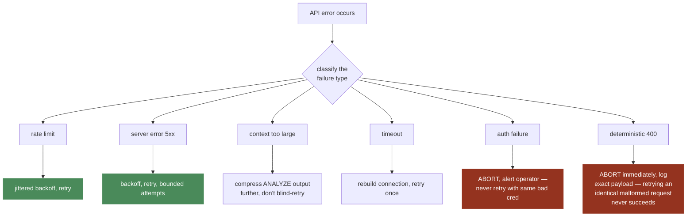
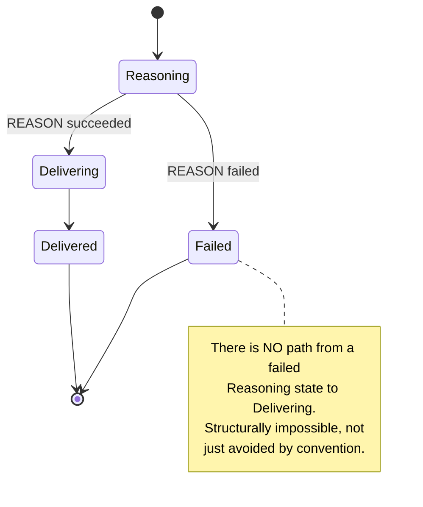
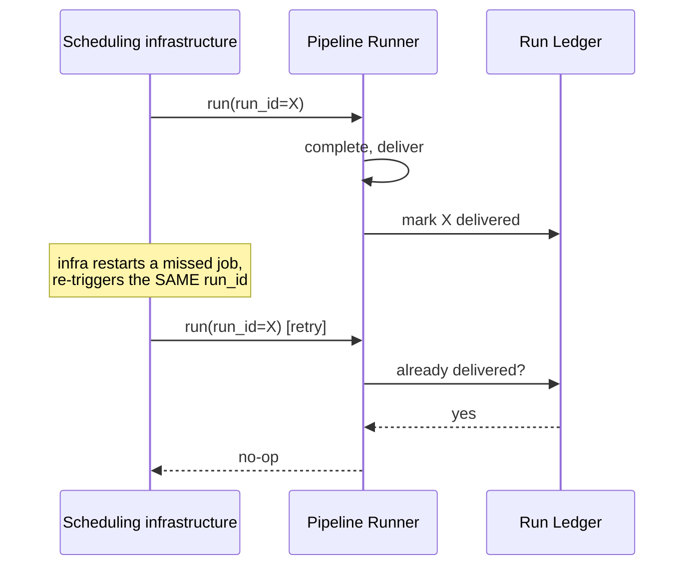

# Reliability

**This is an ENGINE-level standard.** Grounded in Hermes's real
`error_classifier.py` (`FailoverReason`, ~20 distinct failure types each
mapped to a DIFFERENT recovery strategy), scoped to the failure modes
this engine can actually encounter, extended with a concern Hermes's
workload shape doesn't have.

## 1. Classified failure handling — the core principle

**The underlying principle, stated plainly: retrying is only correct
when the retry has a real chance of succeeding.** A deterministic
failure (bad request shape, permanently revoked auth) retried blindly
just burns cost and time for a guaranteed-identical result. Hermes's
classifier exists specifically to tell these apart — so does ours, scoped
to the strict subset of failure modes our narrower engine can actually
hit (we don't have Hermes's full surface of 20+ platforms/providers, so
our table is intentionally shorter, not less rigorous).

## 2. Per-recipient failure reporting (bulk operations)

Already specified structurally in `docs/engine/09-CHANNELS.md` — a bulk
send reports EVERY recipient's outcome individually, never silently
dropping a failed one from the result. Restated here as a reliability
property: a caller must always be able to answer "did recipient X
actually get this" with certainty, not an assumption.

## 3. No partial delivery, ever

Already specified in `docs/engine/08-PIPELINE-SCHEDULER.md`'s state
machine — restated here because it's as much a reliability guarantee (no
half-correct report ever reaches anyone) as a design principle.

## 4. Idempotent re-runs — a concern Hermes's shape doesn't have

Every pipeline run is identified by a `run_id`
(`docs/TECHNICAL_SPEC.md` §3). A run with the same `run_id` re-executed
(e.g. a scheduler retry after a transient infra failure) must NOT
produce a duplicate delivery — the DELIVER stage checks whether this
`run_id` already successfully delivered before sending again.

**Why this is genuinely new, not a copy of Hermes:** our pipelines are
unattended and may be retried by infrastructure outside the agent's own
control (a scheduler restarting a missed job). A human-driven Hermes
chat doesn't have this failure mode in the same way — there's always a
human in the loop who would notice a duplicate response.

## 5. Approval timeout/rejection as first-class terminal states

An `ApprovalGate` request (`docs/engine/10-ACCESS-CONTROL.md`) that is
rejected, edited, or never resolved must leave the pipeline run in a
clearly terminal state — never silently retried as if nothing happened,
never silently treated as accepted. This is the same "no ambiguous
intermediate state" discipline as §3 above, applied to the
human-in-the-loop boundary specifically.

## Cross-references

- Failure classification lives alongside the provider call:
  `docs/engine/02-MODEL-PROVIDER.md`.
- Pipeline state machine this all enforces against:
  `docs/engine/08-PIPELINE-SCHEDULER.md`.
- Observability of failure reasons (for post-incident review):
  `OBSERVABILITY.md` §1.
