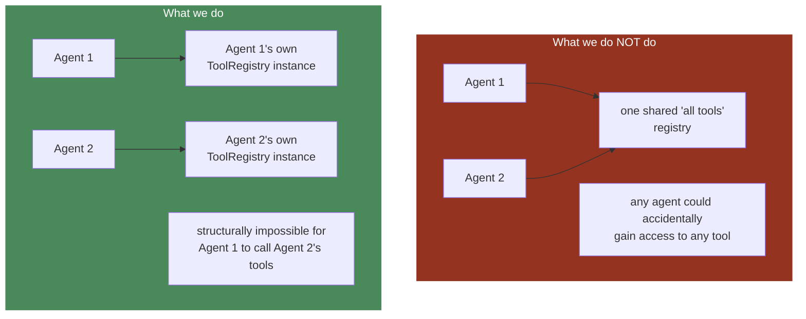
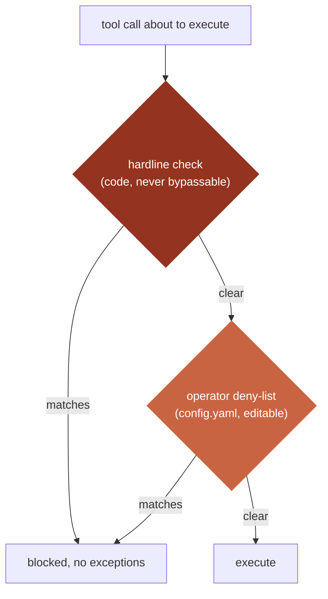
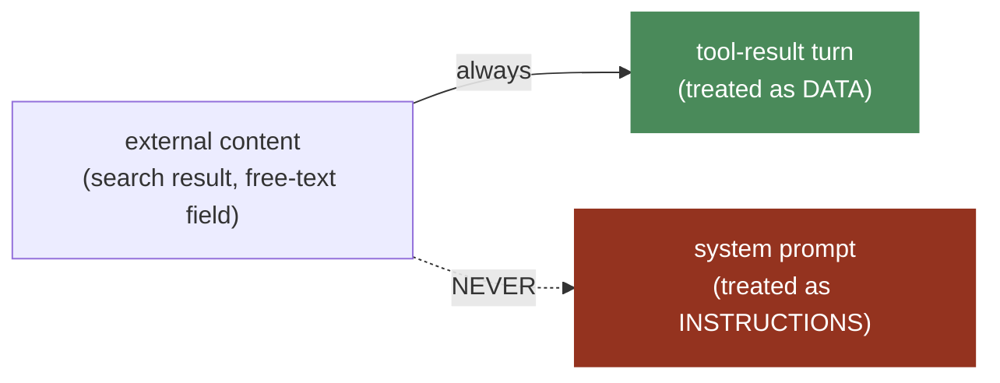

# Security

**This is an ENGINE-level standard** — applies to every subsystem in
`docs/engine/`, and every agent built on top of them. Grounded in real,
working Hermes mechanisms (`/home/ubuntu/.hermes/hermes-agent`), scoped
down to what this engine's narrower workload actually needs.

## The structural advantage this engine has over Hermes

Hermes is general-purpose — a user might ask it to do almost anything,
so it must support a wide tool surface and defend against an open-ended
range of requests. **Every agent on this engine has a known, narrow job**
(see `docs/engine/00-OVERVIEW.md`). That difference is the single
biggest security lever available here: a narrow job means a narrow,
fully-enumerable attack surface, by construction — not by vigilance.

## 1. Minimal tool surface, enforced per agent

**Rule:** no agent gets a default toolset. Every tool an agent can call
is explicitly registered into THAT agent's own `ToolRegistry` instance
(`docs/engine/03-TOOLS.md`) — there is no shared registry to
accidentally inherit access from.

**Concrete decision rule:** before registering a tool to an agent, ask
"does THIS agent's specific job require this," never "could this be
useful." This is Hermes's own footprint-ladder principle
(`docs/engine/11-EXTENSIBILITY.md`), applied MORE aggressively than
Hermes applies it to itself — because our per-agent job is narrower than
Hermes's own open-ended one.

## 2. Blast-radius tiering — the enforcement table

Every tool registered anywhere gets an explicit tier AT REGISTRATION
TIME, never inferred later:

| Tier | Examples | Gate required |
|---|---|---|
| **Read-only** | query data, read status, web search | None |
| **Reversible write** | draft a report, draft a message (not sent) | None |
| **Consequential, single-recipient** | send one message to one already-whitelisted contact | `WhitelistGate` mandatory |
| **Consequential, bulk/irreversible** | bulk send, any negotiation/business action, identity provisioning | `WhitelistGate` AND `ApprovalGate` mandatory — **not configurable off** |

This turns `docs/engine/03-TOOLS.md`'s blast-radius concept from a
principle into an enforced field (`Tool.blast_radius`, required, not
optional) — every new tool is placed in this table before registration.

## 3. The hardline layer — same shape as Hermes, different content

Hermes's real pattern (`tools/approval.py`'s `detect_hardline_command()`)
is genuinely good: a CODE-LEVEL, never-bypassable blocklist for
catastrophic operations, PLUS a user-editable deny-list layered on top —
both checked before any approval-bypass mode could skip them.

**We adopt the same two-tier SHAPE, scoped to what our agents actually
do** (not shell commands — our agents don't run arbitrary shell):

- **Hardline tier (code, never bypassable):** a tool can never send to a
  recipient outside its own profile's registered recipient range; a tool
  can never read another profile's directory — enforced by WHICH
  `SessionStore`/`ProfileManager` instance the running agent was
  constructed with (`docs/engine/06-PROFILES.md`), as defense in depth,
  not merely "shouldn't happen."
- **Operator deny-list tier (config, editable without a code change):** a
  specific recipient temporarily blocked, a specific profile temporarily
  suspended — lives in that profile's `config.yaml`
  (`docs/engine/07-CONFIG-SECRETS.md`), checked at the same gate.

## 4. Credential and data isolation — a security property, not just organization

`docs/engine/06-PROFILES.md`'s directory-per-profile isolation is, among
other things, a SECURITY boundary: a compromised or misbehaving agent
instance cannot read another profile's credentials or session history,
because they are not reachable from that process's own filesystem view
— not because of a runtime permission check that could itself have a
bug. Isolation by construction beats isolation by vigilance.

## 5. Prompt-injection awareness

Any tool whose result text the model will read back (search results,
ingested free-text fields) is a real prompt-injection surface —
instructions embedded in that content are untrusted.

**Rule:** tool RESULTS are never treated as instructions, only as data
to reason about — enforced by never concatenating raw external content
into the system prompt (which the model weighs more heavily), always
keeping it in tool-result turns.

## 6. Full permissions layering (defense in depth, summarized)

| Layer | Mechanism | Specified in |
|---|---|---|
| Which tools an agent can call at all | Per-agent `ToolRegistry`, explicit registration only | §1 above, `docs/engine/03-TOOLS.md` |
| Which profile's data a running agent can reach | Which `SessionStore`/`ProfileManager` instance it was constructed with | §4 above, `docs/engine/06-PROFILES.md` |
| Which recipients a send-capable tool can reach | `WhitelistGate` at the execution boundary | §2 above, `docs/engine/10-ACCESS-CONTROL.md` |
| Which consequential actions require a human | `ApprovalGate`, mandatory for the bulk/irreversible tier | §2 above, `docs/engine/10-ACCESS-CONTROL.md` |
| Operator-level overrides | Config deny-list, same gate as hardline | §3 above |

No single layer is trusted alone — a tool that shouldn't exist for an
agent is caught by registration; if it somehow existed, the whitelist
catches a bad recipient; if that failed, the approval gate catches a
bulk/irreversible action before it executes. Any one layer having a bug
should never be sufficient to cause harm by itself.
